2019HW\_week8&9\_bangladesh
================

-   [Bangladeshy birth rates](#bangladeshy-birth-rates)
    -   [Load data](#load-data)
    -   [Model 1: traditional fixed effects model](#model-1-traditional-fixed-effects-model)
    -   [Model 2 Centered partial pooling version](#model-2-centered-partial-pooling-version)
    -   [Model 3 non-centered version of the hierachical model](#model-3-non-centered-version-of-the-hierachical-model)
    -   [Model 4 brms version of the non-centered](#model-4-brms-version-of-the-non-centered)
    -   [Model 5 varying slope with covariance](#model-5-varying-slope-with-covariance)
    -   [Model 7 causal inference of age and living children](#model-7-causal-inference-of-age-and-living-children)
    -   [Model 8 causal inference of age and living children without interaction](#model-8-causal-inference-of-age-and-living-children-without-interaction)
    -   [Model 9 total influence of age](#model-9-total-influence-of-age)
    -   [Model 10 influence of age with interaction](#model-10-influence-of-age-with-interaction)
    -   [Model 11 children as categorical predictor](#model-11-children-as-categorical-predictor)

Bangladeshy birth rates
-----------------------

Would prefer to tackle the series of questions on bangladeshy birth rates questions first

### Load data

The professor is super kind to alert us the district is not a factor and actually contains one missing district: 54

I shall try to find it out

``` r
rng <- range(d$district)
which(!(rng[1]:rng[2] %in% d$district))
```

    ## [1] 54

and it worked!

### Model 1: traditional fixed effects model

should use better priors than norm(0,1)

``` r
a <- rnorm(1e4,0,1.5)
p <- inv_logit(a)
dens(p)
```

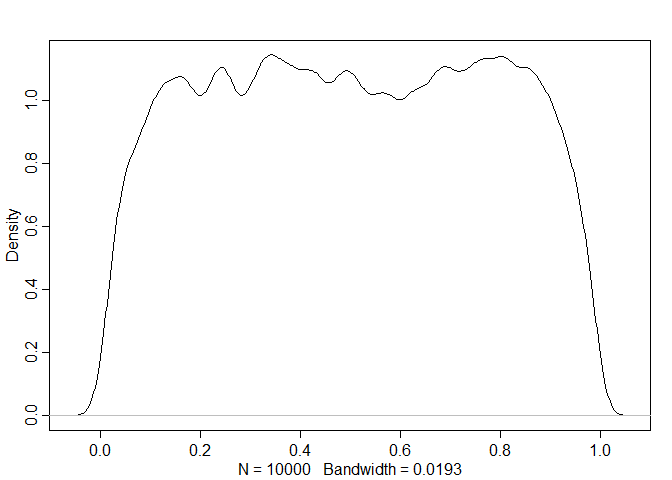

``` r
m_contra_1 <- ulam(
  alist(
    contraception ~ dbinom(1, p),
    logit(p) <- a[dist_id],
    a[dist_id] ~ dnorm(0,1.5)
  ), data = dat, cores = 4, chains = 4, log_lik = 4 
)
```

just a quick look at the posterier samples

``` r
precis(m_contra_1, depth = 2) %>% data.frame -> post_summary
post_summary <- post_summary %>% 
  mutate(dist_id = 1:n(),
         ymin = X5.5. %>% inv_logit(),
         ymax = X94.5.%>% inv_logit(),
         y = mean %>% inv_logit(),
         pooling = "no"
         )
data_proportion <- d %>% group_by(district_id) %>% summarise(proportion = mean(use.contraception))
```

``` r
post_summary %>%
  ggplot(aes(x = dist_id, y = y, ymax = ymax, ymin = ymin))+
  geom_point(shape = 1)+
  geom_linerange()+
  geom_point(data = data_proportion, aes(x = district_id, y = proportion), color = "red", inherit.aes = F)+
  labs(x = "district ID", y = "probability of using contraception")+
  theme_fivethirtyeight()
```

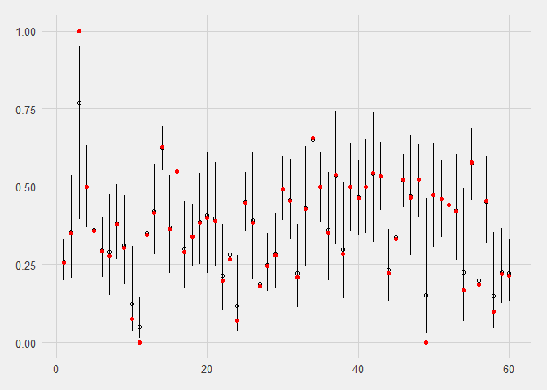

### Model 2 Centered partial pooling version

Centered version first and see how it goes

``` r
m_contra_2 <- ulam(
  alist(
    contraception ~ dbinom(1, p),
    logit(p) <- a[dist_id],
    a[dist_id] ~ dnorm(mu, sigma),
    mu ~ dnorm(0, 1.5),
    sigma ~ dexp(1)
  ), data = dat, cores = 4, chains = 4, log_lik = 4 
)
```

``` r
precis(m_contra_2, depth = 2) %>% plot
```

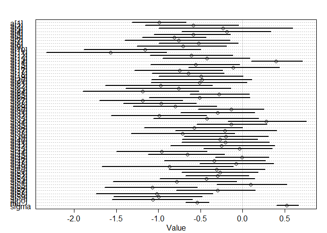

``` r
precis(m_contra_2, depth = 2) %>% data.frame -> post_summary2
post_summary2 <- post_summary2 %>% 
  mutate(dist_id = 1:n()+0.3,
         ymin = X5.5. %>% inv_logit(),
         ymax = X94.5.%>% inv_logit(),
         y = mean %>% inv_logit(),
         pooling = "partial"
         )
data_proportion <- d %>% group_by(district_id) %>% summarise(proportion = mean(use.contraception))
```

``` r
post_summary2 %>%
  ggplot(aes(x = dist_id, y = y, ymax = ymax, ymin = ymin))+
  geom_point(shape = 1)+
  geom_linerange()+
  geom_point(data = data_proportion, aes(x = district_id, y = proportion), color = "red", inherit.aes = F)+
  labs(x = "district ID", y = "probability of using contraception")+
  theme_fivethirtyeight()
```

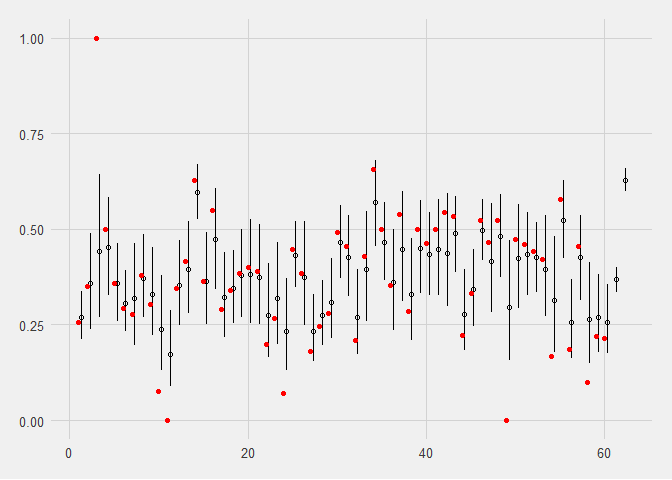 Time to contrast the models

``` r
post_summary <- post_summary %>% 
  bind_rows(post_summary2)
```

``` r
post_summary %>%
  ggplot(aes(x = dist_id, y = y, ymax = ymax, ymin = ymin, color = pooling))+
  geom_point(shape = 1, alpha=0.5)+
  geom_linerange(alpha=0.5)+
  geom_point(data = data_proportion, aes(x = district_id, y = proportion), color = "red", inherit.aes = F)+
  geom_hline(yintercept = mean(d$use.contraception), linetype = "dashed")+
  labs(x = "district ID", y = "probability of using contraception")+
  theme_fivethirtyeight()
```

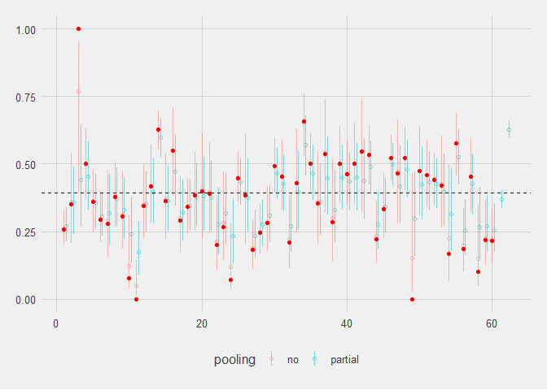

This is problemmatic - if we look at district 3, the partial pooling results seems to gravitate towards below 0.5, where data is clearly 1. checked the solutions and yes indeed it should shrink to the global mean!

``` r
d %>% 
  count(district) %>% 
  filter(n<10)
```

    ## # A tibble: 3 x 2
    ##   district     n
    ##      <int> <int>
    ## 1        3     2
    ## 2       49     4
    ## 3       55     6

### Model 3 non-centered version of the hierachical model

``` r
m_contra_3 <- ulam(
  alist(
    contraception ~ bernoulli(p),
    logit(p) <- a_bar + a[dist_id] * sigma_dist,
    a_bar ~ dnorm(0, 1.5),
    sigma_dist ~ dexp(1),
    a[dist_id]~dnorm(0,1)
  ),
  data = dat, cores = 4, chains = 4
)
```

``` r
precis(m_contra_3, depth = 2) %>% plot
```

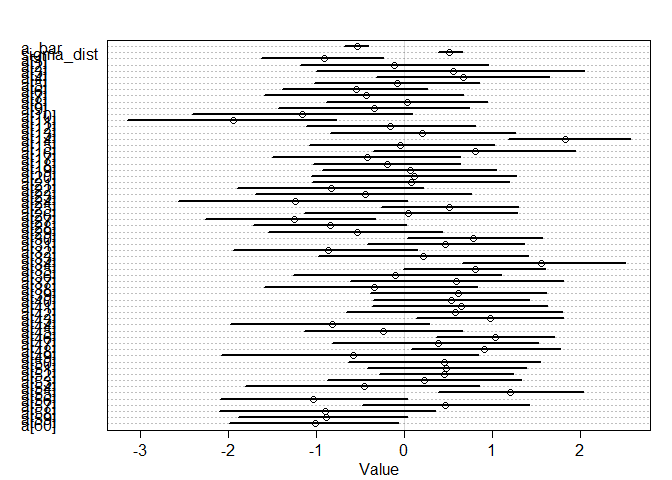

``` r
post_summary3 <- precis(m_contra_3, depth = 2)
```

### Model 4 brms version of the non-centered

instead of trying to re-create the parameter and compare with the centered version, decided to use brms to checking.

before loading the brms, maybe I need to unload the rethinking package first?

``` r
library(brms)
```

    ## Warning: package 'brms' was built under R version 3.5.3

    ## Loading required package: Rcpp

    ## Warning: package 'Rcpp' was built under R version 3.5.3

    ## Loading 'brms' package (version 2.8.0). Useful instructions
    ## can be found by typing help('brms'). A more detailed introduction
    ## to the package is available through vignette('brms_overview').

    ## 
    ## Attaching package: 'brms'

    ## The following objects are masked from 'package:rethinking':
    ## 
    ##     LOO, stancode, WAIC

    ## The following object is masked from 'package:rstan':
    ## 
    ##     loo

``` r
get_prior(data = dat, family = bernoulli,
                  contraception ~  (1 | dist_id))
```

    ##                 prior     class      coef   group resp dpar nlpar bound
    ## 1 student_t(3, 0, 10) Intercept                                        
    ## 2 student_t(3, 0, 10)        sd                                        
    ## 3                            sd           dist_id                      
    ## 4                            sd Intercept dist_id

Cannot test this as brms crashes rstudio if I try to fit model more than 1 layer

``` r
b_contra_3 <- brm(data = dat, family = bernoulli,
                  contraception ~ 1 + (1 | dist_id),
                  prior = prior(normal(0,1.5), class = Intercept) +
                          prior(exponential(1), class = sd)
                  )
```

    ## 
    ## SAMPLING FOR MODEL 'efb7be03cd6d5c100d19e506e4967448' NOW (CHAIN 1).
    ## Chain 1: 
    ## Chain 1: Gradient evaluation took 0 seconds
    ## Chain 1: 1000 transitions using 10 leapfrog steps per transition would take 0 seconds.
    ## Chain 1: Adjust your expectations accordingly!
    ## Chain 1: 
    ## Chain 1: 
    ## Chain 1: Iteration:    1 / 2000 [  0%]  (Warmup)
    ## Chain 1: Iteration:  200 / 2000 [ 10%]  (Warmup)
    ## Chain 1: Iteration:  400 / 2000 [ 20%]  (Warmup)
    ## Chain 1: Iteration:  600 / 2000 [ 30%]  (Warmup)
    ## Chain 1: Iteration:  800 / 2000 [ 40%]  (Warmup)
    ## Chain 1: Iteration: 1000 / 2000 [ 50%]  (Warmup)
    ## Chain 1: Iteration: 1001 / 2000 [ 50%]  (Sampling)
    ## Chain 1: Iteration: 1200 / 2000 [ 60%]  (Sampling)
    ## Chain 1: Iteration: 1400 / 2000 [ 70%]  (Sampling)
    ## Chain 1: Iteration: 1600 / 2000 [ 80%]  (Sampling)
    ## Chain 1: Iteration: 1800 / 2000 [ 90%]  (Sampling)
    ## Chain 1: Iteration: 2000 / 2000 [100%]  (Sampling)
    ## Chain 1: 
    ## Chain 1:  Elapsed Time: 4.332 seconds (Warm-up)
    ## Chain 1:                4.512 seconds (Sampling)
    ## Chain 1:                8.844 seconds (Total)
    ## Chain 1: 
    ## 
    ## SAMPLING FOR MODEL 'efb7be03cd6d5c100d19e506e4967448' NOW (CHAIN 2).
    ## Chain 2: 
    ## Chain 2: Gradient evaluation took 0 seconds
    ## Chain 2: 1000 transitions using 10 leapfrog steps per transition would take 0 seconds.
    ## Chain 2: Adjust your expectations accordingly!
    ## Chain 2: 
    ## Chain 2: 
    ## Chain 2: Iteration:    1 / 2000 [  0%]  (Warmup)
    ## Chain 2: Iteration:  200 / 2000 [ 10%]  (Warmup)
    ## Chain 2: Iteration:  400 / 2000 [ 20%]  (Warmup)
    ## Chain 2: Iteration:  600 / 2000 [ 30%]  (Warmup)
    ## Chain 2: Iteration:  800 / 2000 [ 40%]  (Warmup)
    ## Chain 2: Iteration: 1000 / 2000 [ 50%]  (Warmup)
    ## Chain 2: Iteration: 1001 / 2000 [ 50%]  (Sampling)
    ## Chain 2: Iteration: 1200 / 2000 [ 60%]  (Sampling)
    ## Chain 2: Iteration: 1400 / 2000 [ 70%]  (Sampling)
    ## Chain 2: Iteration: 1600 / 2000 [ 80%]  (Sampling)
    ## Chain 2: Iteration: 1800 / 2000 [ 90%]  (Sampling)
    ## Chain 2: Iteration: 2000 / 2000 [100%]  (Sampling)
    ## Chain 2: 
    ## Chain 2:  Elapsed Time: 4.569 seconds (Warm-up)
    ## Chain 2:                4.782 seconds (Sampling)
    ## Chain 2:                9.351 seconds (Total)
    ## Chain 2: 
    ## 
    ## SAMPLING FOR MODEL 'efb7be03cd6d5c100d19e506e4967448' NOW (CHAIN 3).
    ## Chain 3: 
    ## Chain 3: Gradient evaluation took 0 seconds
    ## Chain 3: 1000 transitions using 10 leapfrog steps per transition would take 0 seconds.
    ## Chain 3: Adjust your expectations accordingly!
    ## Chain 3: 
    ## Chain 3: 
    ## Chain 3: Iteration:    1 / 2000 [  0%]  (Warmup)
    ## Chain 3: Iteration:  200 / 2000 [ 10%]  (Warmup)
    ## Chain 3: Iteration:  400 / 2000 [ 20%]  (Warmup)
    ## Chain 3: Iteration:  600 / 2000 [ 30%]  (Warmup)
    ## Chain 3: Iteration:  800 / 2000 [ 40%]  (Warmup)
    ## Chain 3: Iteration: 1000 / 2000 [ 50%]  (Warmup)
    ## Chain 3: Iteration: 1001 / 2000 [ 50%]  (Sampling)
    ## Chain 3: Iteration: 1200 / 2000 [ 60%]  (Sampling)
    ## Chain 3: Iteration: 1400 / 2000 [ 70%]  (Sampling)
    ## Chain 3: Iteration: 1600 / 2000 [ 80%]  (Sampling)
    ## Chain 3: Iteration: 1800 / 2000 [ 90%]  (Sampling)
    ## Chain 3: Iteration: 2000 / 2000 [100%]  (Sampling)
    ## Chain 3: 
    ## Chain 3:  Elapsed Time: 4.398 seconds (Warm-up)
    ## Chain 3:                3.278 seconds (Sampling)
    ## Chain 3:                7.676 seconds (Total)
    ## Chain 3: 
    ## 
    ## SAMPLING FOR MODEL 'efb7be03cd6d5c100d19e506e4967448' NOW (CHAIN 4).
    ## Chain 4: 
    ## Chain 4: Gradient evaluation took 0.001 seconds
    ## Chain 4: 1000 transitions using 10 leapfrog steps per transition would take 10 seconds.
    ## Chain 4: Adjust your expectations accordingly!
    ## Chain 4: 
    ## Chain 4: 
    ## Chain 4: Iteration:    1 / 2000 [  0%]  (Warmup)
    ## Chain 4: Iteration:  200 / 2000 [ 10%]  (Warmup)
    ## Chain 4: Iteration:  400 / 2000 [ 20%]  (Warmup)
    ## Chain 4: Iteration:  600 / 2000 [ 30%]  (Warmup)
    ## Chain 4: Iteration:  800 / 2000 [ 40%]  (Warmup)
    ## Chain 4: Iteration: 1000 / 2000 [ 50%]  (Warmup)
    ## Chain 4: Iteration: 1001 / 2000 [ 50%]  (Sampling)
    ## Chain 4: Iteration: 1200 / 2000 [ 60%]  (Sampling)
    ## Chain 4: Iteration: 1400 / 2000 [ 70%]  (Sampling)
    ## Chain 4: Iteration: 1600 / 2000 [ 80%]  (Sampling)
    ## Chain 4: Iteration: 1800 / 2000 [ 90%]  (Sampling)
    ## Chain 4: Iteration: 2000 / 2000 [100%]  (Sampling)
    ## Chain 4: 
    ## Chain 4:  Elapsed Time: 4.147 seconds (Warm-up)
    ## Chain 4:                3.61 seconds (Sampling)
    ## Chain 4:                7.757 seconds (Total)
    ## Chain 4:

``` r
b_contra_3 %>% summary
```

    ##  Family: bernoulli 
    ##   Links: mu = logit 
    ## Formula: contraception ~ 1 + (1 | dist_id) 
    ##    Data: dat (Number of observations: 1934) 
    ## Samples: 4 chains, each with iter = 2000; warmup = 1000; thin = 1;
    ##          total post-warmup samples = 4000
    ## 
    ## Group-Level Effects: 
    ## ~dist_id (Number of levels: 60) 
    ##               Estimate Est.Error l-95% CI u-95% CI Eff.Sample Rhat
    ## sd(Intercept)     0.52      0.08     0.38     0.69       1421 1.00
    ## 
    ## Population-Level Effects: 
    ##           Estimate Est.Error l-95% CI u-95% CI Eff.Sample Rhat
    ## Intercept    -0.54      0.09    -0.72    -0.37       2809 1.00
    ## 
    ## Samples were drawn using sampling(NUTS). For each parameter, Eff.Sample 
    ## is a crude measure of effective sample size, and Rhat is the potential 
    ## scale reduction factor on split chains (at convergence, Rhat = 1).

``` r
precis(m_contra_3)
```

    ## 60 vector or matrix parameters hidden. Use depth=2 to show them.

    ##                  mean         sd       5.5%      94.5%    n_eff     Rhat
    ## a_bar      -0.5368182 0.08895214 -0.6789134 -0.4015435 561.6846 1.007665
    ## sigma_dist  0.5155929 0.08505725  0.3928024  0.6622628 747.7785 1.004568

``` r
coef(b_contra_3)$dist_id[1:5,,]
```

    ##     Estimate Est.Error       Q2.5       Q97.5
    ## 1 -0.9940590 0.1920961 -1.3672685 -0.61507242
    ## 2 -0.5933818 0.3437521 -1.2985557  0.06381112
    ## 3 -0.2317461 0.5028985 -1.1585704  0.81118196
    ## 4 -0.1835840 0.3101997 -0.7717707  0.43697437
    ## 5 -0.5678824 0.2798801 -1.1344775 -0.03948644

``` r
precis(m_contra_2, depth = 2)
```

    ##               mean         sd       5.5%        94.5%     n_eff      Rhat
    ## a[1]  -0.991183647 0.19394552 -1.3121901 -0.673542673 4354.0707 1.0002084
    ## a[2]  -0.585812789 0.34625070 -1.1561431 -0.047570352 4116.3202 0.9991871
    ## a[3]  -0.233521911 0.50376725 -0.9941511  0.593220508 2965.3535 0.9989874
    ## a[4]  -0.185929244 0.32108037 -0.7235164  0.332699157 4574.1460 0.9991816
    ## a[5]  -0.583908503 0.28523329 -1.0527341 -0.146846377 3679.7136 0.9992419
    ## a[6]  -0.813988130 0.23066568 -1.1937901 -0.436611785 4040.5617 0.9997486
    ## a[7]  -0.757433657 0.38805013 -1.4018544 -0.151932951 3353.0871 0.9991676
    ## a[8]  -0.522382382 0.29119017 -0.9974227 -0.057067019 2873.8418 0.9989007
    ## a[9]  -0.707042130 0.33124407 -1.2569359 -0.194889281 3541.1082 0.9998713
    ## a[10] -1.157491330 0.43045628 -1.8859281 -0.497390307 2580.1158 0.9988795
    ## a[11] -1.567944289 0.44107708 -2.3325365 -0.901546824 2154.7109 0.9995374
    ## a[12] -0.610148540 0.30717820 -1.1003592 -0.119649168 3894.7873 1.0004110
    ## a[13] -0.421984729 0.33091069 -0.9473413  0.085060635 2945.4118 1.0006331
    ## a[14]  0.394680748 0.18709385  0.1000718  0.706325955 3909.3951 0.9983232
    ## a[15] -0.557420404 0.33224482 -1.0927692 -0.035891484 2967.7719 0.9982234
    ## a[16] -0.110210241 0.33671564 -0.6457892  0.434132066 3214.6087 0.9984855
    ## a[17] -0.746305326 0.33686827 -1.2872647 -0.239069520 4898.1662 0.9985484
    ## a[18] -0.642012799 0.27070788 -1.0756839 -0.219485555 3712.7235 0.9989130
    ## a[19] -0.496448973 0.31371865 -0.9944822  0.002912049 3564.0776 0.9997557
    ## a[20] -0.480440681 0.37544793 -1.0832122  0.105028927 3311.6117 0.9996496
    ## a[21] -0.509999113 0.36356981 -1.0911075  0.050862288 3982.4519 0.9984324
    ## a[22] -0.972825786 0.39075755 -1.6286386 -0.359490428 3110.3059 0.9998738
    ## a[23] -0.760287590 0.38786340 -1.3908701 -0.140450967 3239.1696 0.9983955
    ## a[24] -1.187263858 0.43536256 -1.8945389 -0.523845821 2728.2540 0.9985886
    ## a[25] -0.277812806 0.22477386 -0.6271425  0.078087598 3798.2229 0.9984986
    ## a[26] -0.508928114 0.37728565 -1.1107345  0.083117706 3546.9040 0.9996159
    ## a[27] -1.189137495 0.30527351 -1.6984115 -0.713774986 2730.5420 0.9992791
    ## a[28] -0.967097105 0.27071285 -1.4155472 -0.550248589 2953.5933 0.9984038
    ## a[29] -0.800160583 0.31264378 -1.3037490 -0.306792423 3619.9391 0.9991148
    ## a[30] -0.135508480 0.24300009 -0.5262315  0.251421304 3990.6919 0.9984870
    ## a[31] -0.295064091 0.28268520 -0.7386959  0.143282409 4830.4641 0.9991735
    ## a[32] -0.991367316 0.36196428 -1.5626342 -0.430136771 3105.9827 0.9995774
    ## a[33] -0.427036429 0.38485203 -1.0569191  0.190486724 3316.4869 0.9989292
    ## a[34]  0.279000179 0.29615399 -0.1765997  0.753985940 2909.6740 0.9992341
    ## a[35] -0.133461736 0.25657730 -0.5465656  0.284906792 3877.5758 0.9990050
    ## a[36] -0.571678676 0.36475452 -1.1717360 -0.001742107 5666.0762 0.9984743
    ## a[37] -0.211653640 0.37700377 -0.7984575  0.402166595 4214.3624 0.9985552
    ## a[38] -0.710865082 0.38474677 -1.3265721 -0.094089933 4483.7591 0.9991333
    ## a[39] -0.199034079 0.30680600 -0.6933779  0.301530071 4372.9117 0.9991045
    ## a[40] -0.266510068 0.28356376 -0.7161433  0.177814309 4955.7738 0.9994712
    ## a[41] -0.205721252 0.32465654 -0.7255942  0.314033526 5712.6142 0.9986979
    ## a[42] -0.253424172 0.38659399 -0.8568549  0.378560937 4055.8494 0.9985871
    ## a[43] -0.039276806 0.25042674 -0.4630211  0.350323765 5092.5768 0.9994394
    ## a[44] -0.959544191 0.33648692 -1.4998624 -0.423989961 3576.1367 0.9990580
    ## a[45] -0.656431089 0.27785789 -1.1214252 -0.215841254 3509.5456 0.9990640
    ## a[46] -0.006572857 0.20297032 -0.3288743  0.311662361 3270.4749 0.9986826
    ## a[47] -0.335971781 0.37782831 -0.9344080  0.271317555 3653.5552 0.9996930
    ## a[48] -0.075962274 0.27396718 -0.5135422  0.364316681 3940.7506 0.9993940
    ## a[49] -0.868707294 0.49212736 -1.6714861 -0.112365609 2824.5608 0.9986391
    ## a[50] -0.307045553 0.36448672 -0.8744063  0.264402130 3424.2395 0.9991150
    ## a[51] -0.267938751 0.27784972 -0.7228132  0.180991922 4353.4650 0.9993266
    ## a[52] -0.298034536 0.23679285 -0.6808486  0.072464502 3991.6556 0.9984145
    ## a[53] -0.427354406 0.34491828 -0.9870786  0.144446978 4032.0021 0.9989522
    ## a[54] -0.779653808 0.47705012 -1.5385779 -0.070530079 2656.9474 0.9992978
    ## a[55]  0.098169544 0.26364017 -0.3115942  0.524936135 3240.7374 0.9989871
    ## a[56] -1.069612637 0.34154236 -1.6348086 -0.541492688 2944.4710 0.9987250
    ## a[57] -0.299437979 0.28876800 -0.7865331  0.147756095 4603.1766 0.9984780
    ## a[58] -1.018384614 0.43379055 -1.7388787 -0.352841972 2287.1371 0.9996931
    ## a[59] -0.996848402 0.32467071 -1.5313802 -0.480408019 3114.8756 0.9987191
    ## a[60] -1.067678115 0.29204448 -1.5520617 -0.596940701 3235.9982 0.9992361
    ## mu    -0.537564337 0.08857090 -0.6803992 -0.398727501 1705.2741 0.9994900
    ## sigma  0.522208598 0.08253084  0.4009928  0.663280516  817.3634 1.0012801

basically the brms coef function returns the coefficient of variables as if it is a centered model.

``` r
fixef(b_contra_3)
```

    ##             Estimate  Est.Error       Q2.5      Q97.5
    ## Intercept -0.5382929 0.08950932 -0.7168161 -0.3679737

``` r
precis(m_contra_3, depth = 2)
```

    ##                   mean         sd         5.5%       94.5%     n_eff
    ## a_bar      -0.53681824 0.08895214 -0.678913384 -0.40154355  561.6846
    ## sigma_dist  0.51559287 0.08505725  0.392802354  0.66226276  747.7785
    ## a[1]       -0.90687952 0.43426651 -1.629392875 -0.23651790 1639.4242
    ## a[2]       -0.11349207 0.66840604 -1.179357815  0.95762459 3530.6346
    ## a[3]        0.55716948 0.97432512 -0.997752870  2.04517053 2755.1870
    ## a[4]        0.67593192 0.61323280 -0.314870578  1.65195435 2731.7581
    ## a[5]       -0.07850747 0.57777838 -1.015980740  0.85761062 2582.1470
    ## a[6]       -0.54736545 0.51364094 -1.389428506  0.26366630 2329.6497
    ## a[7]       -0.43300000 0.71201626 -1.592028158  0.66984114 3388.7766
    ## a[8]        0.04125548 0.57267051 -0.881603222  0.94697870 2349.8028
    ## a[9]       -0.33723391 0.68199094 -1.432764527  0.74558038 3196.4468
    ## a[10]      -1.15513446 0.80882751 -2.414749474  0.09562739 2954.8401
    ## a[11]      -1.94146740 0.74646281 -3.145504260 -0.77557275 4056.4842
    ## a[12]      -0.15478709 0.61433907 -1.108625167  0.80917493 3383.1734
    ## a[13]       0.20488214 0.66259327 -0.834420063  1.26942708 3244.5914
    ## a[14]       1.83908896 0.43223695  1.185525709  2.57716365 1344.7232
    ## a[15]      -0.04380194 0.65666004 -1.079593690  1.02725960 2691.1383
    ## a[16]       0.81192298 0.71401525 -0.348384436  1.94709526 3147.6090
    ## a[17]      -0.41400157 0.65665716 -1.497661792  0.64433983 2963.8435
    ## a[18]      -0.18673368 0.53293200 -1.032946115  0.64383331 2681.0969
    ## a[19]       0.07311965 0.60670806 -0.934899994  1.05360036 2614.6125
    ## a[20]       0.11330489 0.73510631 -1.058461409  1.27904645 3114.6930
    ## a[21]       0.08321791 0.70019433 -1.047071058  1.20149324 2295.7438
    ## a[22]      -0.82815074 0.66815622 -1.902852571  0.21373851 2816.7794
    ## a[23]      -0.44323796 0.76566573 -1.695606723  0.76301375 2376.2050
    ## a[24]      -1.23536538 0.80281144 -2.565369808  0.03522475 3720.6822
    ## a[25]       0.50984914 0.48545719 -0.263008872  1.30179893 2248.0411
    ## a[26]       0.04694083 0.75717918 -1.136732775  1.28837798 3172.3414
    ## a[27]      -1.25180784 0.59703257 -2.261225340 -0.32454172 2653.5619
    ## a[28]      -0.84123958 0.55430820 -1.719751243  0.02920524 1726.2344
    ## a[29]      -0.53461146 0.62694064 -1.544753521  0.44049964 2792.8053
    ## a[30]       0.79198024 0.47639222  0.038803285  1.57652325 2147.3332
    ## a[31]       0.46879249 0.57467839 -0.416503078  1.37328635 2674.3489
    ## a[32]      -0.86753436 0.64985089 -1.940985003  0.14648094 2876.5890
    ## a[33]       0.22031783 0.74946162 -0.970511370  1.41499395 3002.9405
    ## a[34]       1.56700873 0.57636128  0.660633101  2.51375983 2788.9308
    ## a[35]       0.81108416 0.50971294 -0.007218325  1.60414386 1835.1468
    ## a[36]      -0.09567044 0.72407563 -1.262993652  1.11097267 2775.4471
    ## a[37]       0.58999925 0.75007963 -0.616863970  1.81345101 3330.4563
    ## a[38]      -0.34191185 0.76610187 -1.585534071  0.83335287 3145.5602
    ## a[39]       0.61961392 0.62984666 -0.379478446  1.62359464 3087.1374
    ## a[40]       0.53927366 0.55874430 -0.352286431  1.42146227 2563.2925
    ## a[41]       0.65075212 0.63022439 -0.362332982  1.63299232 2557.8489
    ## a[42]       0.58743706 0.77207421 -0.655520342  1.79876493 2759.1830
    ## a[43]       0.98671743 0.52349250  0.142417870  1.81458867 1992.0016
    ## a[44]      -0.82153930 0.69766979 -1.973383070  0.28764018 2619.9185
    ## a[45]      -0.24151404 0.57324243 -1.140124506  0.65764612 2162.3812
    ## a[46]       1.03409847 0.42123337  0.371899627  1.70550034 1658.6612
    ## a[47]       0.38390456 0.72601378 -0.815555412  1.53127920 3545.7994
    ## a[48]       0.90859132 0.54475654  0.078360458  1.77216883 2243.9817
    ## a[49]      -0.58325017 0.90911234 -2.079487322  0.84159769 3210.6262
    ## a[50]       0.46165887 0.68376682 -0.632160685  1.54519009 2424.6391
    ## a[51]       0.48129215 0.56363883 -0.420929818  1.39079285 2711.5295
    ## a[52]       0.46313402 0.48120379 -0.277386351  1.23764323 1831.5842
    ## a[53]       0.22898130 0.68530743 -0.874313688  1.33447882 2676.4987
    ## a[54]      -0.45722306 0.84396543 -1.808733915  0.86034629 3095.7220
    ## a[55]       1.21160279 0.52909383  0.385186256  2.04162991 1896.0570
    ## a[56]      -1.03374362 0.67424251 -2.091194443  0.03617310 2310.5424
    ## a[57]       0.46604078 0.60234579 -0.477975466  1.42932607 3102.8734
    ## a[58]      -0.90045258 0.78501037 -2.100349517  0.35559537 3491.8195
    ## a[59]      -0.88511944 0.61114043 -1.889703535  0.03993515 3192.7485
    ## a[60]      -1.00982043 0.60681540 -1.992286355 -0.06067888 2548.5293
    ##                 Rhat
    ## a_bar      1.0076655
    ## sigma_dist 1.0045684
    ## a[1]       1.0002605
    ## a[2]       0.9992626
    ## a[3]       0.9987373
    ## a[4]       0.9990925
    ## a[5]       0.9990123
    ## a[6]       0.9992025
    ## a[7]       0.9998634
    ## a[8]       0.9994710
    ## a[9]       0.9992892
    ## a[10]      1.0009989
    ## a[11]      0.9988520
    ## a[12]      0.9992882
    ## a[13]      0.9990351
    ## a[14]      1.0017972
    ## a[15]      0.9989644
    ## a[16]      0.9991435
    ## a[17]      0.9986680
    ## a[18]      0.9989658
    ## a[19]      0.9995482
    ## a[20]      0.9986151
    ## a[21]      0.9996194
    ## a[22]      1.0004187
    ## a[23]      1.0000685
    ## a[24]      0.9988598
    ## a[25]      1.0033336
    ## a[26]      0.9987176
    ## a[27]      0.9984379
    ## a[28]      0.9986039
    ## a[29]      0.9986921
    ## a[30]      1.0014721
    ## a[31]      1.0010779
    ## a[32]      0.9995383
    ## a[33]      1.0002124
    ## a[34]      0.9997412
    ## a[35]      1.0009103
    ## a[36]      1.0001238
    ## a[37]      0.9992688
    ## a[38]      0.9984254
    ## a[39]      0.9990904
    ## a[40]      0.9996844
    ## a[41]      0.9998269
    ## a[42]      0.9986996
    ## a[43]      1.0012602
    ## a[44]      0.9985495
    ## a[45]      0.9990041
    ## a[46]      1.0013665
    ## a[47]      0.9997610
    ## a[48]      0.9996770
    ## a[49]      0.9988204
    ## a[50]      1.0001602
    ## a[51]      0.9997877
    ## a[52]      1.0045285
    ## a[53]      1.0001326
    ## a[54]      1.0001118
    ## a[55]      0.9999281
    ## a[56]      1.0019011
    ## a[57]      1.0001006
    ## a[58]      0.9993400
    ## a[59]      0.9993718
    ## a[60]      1.0000540

``` r
ranef(b_contra_3)$dist_id[1:3,,]
```

    ##      Estimate Est.Error       Q2.5       Q97.5
    ## 1 -0.45576618 0.2038716 -0.8581338 -0.06516969
    ## 2 -0.05508894 0.3466048 -0.7667032  0.60501094
    ## 3  0.30654679 0.4981097 -0.6311144  1.33918371

### Model 5 varying slope with covariance

``` r
dat <- with(d,
            list(dist_id = district_id,
                 contraception = use.contraception %>% as.integer(),
                 urban = urban %>% as.integer()
                   )
            )
```

``` r
m_contra_5 <- ulam(
  alist(
    contraception ~ bernoulli(p),
    logit(p) <- a[dist_id] + b[dist_id] * urban,
    c(a, b)[dist_id] ~ multi_normal(c(mu_a, mu_b), Rho, Sigma),
    mu_a ~ dnorm(0, 1.5),
    mu_b ~ dnorm(0, 0.5),
    Sigma ~ dexp(1),
    Rho ~ lkj_corr(2)
  ),
  data = dat, core = 4, chains = 4
)
```

``` r
precis(m_contra_5, depth = 3) 
```

    ##                 mean           sd         5.5%       94.5%     n_eff
    ## b[1]      1.05650833 3.824528e-01  0.470392675  1.66160940 1738.7931
    ## b[2]      0.60011039 7.139898e-01 -0.527017077  1.73344451 3430.1679
    ## b[3]      0.95229017 7.986795e-01 -0.288061488  2.25427476 1491.5496
    ## b[4]      1.63090977 6.382608e-01  0.709285610  2.67519878  938.3214
    ## b[5]      0.59837458 6.271151e-01 -0.382834357  1.62666215 2591.2523
    ## b[6]      1.31149854 5.542924e-01  0.464058585  2.23921355 1749.6468
    ## b[7]      0.81309985 7.152483e-01 -0.306427933  1.94826814 2845.8045
    ## b[8]      0.92986307 6.375877e-01 -0.015262474  1.99953526 2473.0667
    ## b[9]      1.01202318 6.737177e-01 -0.015072557  2.10591032 1992.6388
    ## b[10]     1.20083852 7.748014e-01  0.002997323  2.43996841 1180.3992
    ## b[11]     1.62269086 8.759850e-01  0.344674558  3.10736262  974.9325
    ## b[12]     0.42867558 5.937974e-01 -0.564020115  1.33108674 2099.6691
    ## b[13]     0.25484886 5.868276e-01 -0.670089907  1.18554379 2239.2625
    ## b[14]     1.23390388 4.359990e-01  0.544631188  1.92363888 1794.9261
    ## b[15]     0.43881791 5.898793e-01 -0.529977473  1.36831196 2205.7692
    ## b[16]     0.56626235 6.766750e-01 -0.465305982  1.64200379 2080.3706
    ## b[17]     0.76850670 7.082005e-01 -0.303786735  1.86367561 2291.3335
    ## b[18]     0.86984965 4.824512e-01  0.107019570  1.64677692 2130.4657
    ## b[19]     0.95797361 6.209688e-01  0.028645296  1.96386155 1842.3813
    ## b[20]     0.53318882 7.314379e-01 -0.612891168  1.67828517 2576.8912
    ## b[21]    -0.36109518 6.878082e-01 -1.538597118  0.64379421 1132.5093
    ## b[22]     0.99221745 7.490131e-01 -0.143293234  2.18900085 1663.2165
    ## b[23]     0.81413308 7.091426e-01 -0.333767624  1.91680730 2065.4667
    ## b[24]     1.23565883 7.656789e-01  0.077373197  2.49625082 1401.9106
    ## b[25]     0.18438287 4.310268e-01 -0.527176691  0.85342577 2490.9716
    ## b[26]     0.56609267 7.272161e-01 -0.637157590  1.66157660 1912.5665
    ## b[27]     1.17832257 6.104695e-01  0.243610327  2.16517591 1567.2980
    ## b[28]     0.70798036 5.749503e-01 -0.222027834  1.58598748 2275.5308
    ## b[29]     1.15960174 6.008478e-01  0.220769124  2.16868844 1802.9930
    ## b[30]     1.03091415 5.008914e-01  0.269512848  1.84865146 1909.9083
    ## b[31]     0.37635623 5.484155e-01 -0.477827466  1.24521523 2520.9052
    ## b[32]     1.00681414 7.278424e-01 -0.108915329  2.14216641 1636.9097
    ## b[33]     1.26060645 6.628709e-01  0.254387217  2.35736000 1462.4100
    ## b[34]    -0.74207565 6.382821e-01 -1.786989079  0.22327280  843.1816
    ## b[35]     0.43378052 4.700500e-01 -0.322932124  1.17666204 2611.8448
    ## b[36]     0.48160918 6.492391e-01 -0.606073268  1.51353339 2684.6796
    ## b[37]     0.26141458 7.340614e-01 -0.922280425  1.35316987 2593.0909
    ## b[38]     1.26561447 6.782703e-01  0.292342422  2.38550672 1378.9628
    ## b[39]     0.24184418 6.510391e-01 -0.784311462  1.24569324 2150.1753
    ## b[40]     0.47492429 4.932576e-01 -0.303992549  1.26331530 2065.6790
    ## b[41]    -0.30847013 6.757144e-01 -1.462908509  0.68281072  988.6421
    ## b[42]    -0.30505493 7.291783e-01 -1.524248732  0.78025825 1094.3082
    ## b[43]     0.41037532 4.766742e-01 -0.345390424  1.18816472 1837.5416
    ## b[44]     0.98735189 7.066577e-01 -0.094122024  2.15127303 1814.8256
    ## b[45]     1.21979633 5.984472e-01  0.290997775  2.24836759 1209.2690
    ## b[46]     0.44114007 4.724197e-01 -0.306149220  1.18416327 2005.5566
    ## b[47]     0.50421293 6.282864e-01 -0.489512965  1.48638185 2511.9459
    ## b[48]     0.37729641 5.220213e-01 -0.448056099  1.19160664 2444.8050
    ## b[49]     0.97375856 7.962601e-01 -0.289804091  2.28624480 1990.6881
    ## b[50]     1.18386031 7.069372e-01  0.154150278  2.38308247 1980.6032
    ## b[51]     0.82001930 5.042085e-01  0.021357222  1.64004342 2306.7675
    ## b[52]    -0.45875221 4.946648e-01 -1.259974546  0.31517873  783.7446
    ## b[53]     0.49388487 6.871590e-01 -0.560918318  1.56262663 1998.8044
    ## b[54]     0.24374254 7.751824e-01 -1.046170242  1.40691458 1913.9592
    ## b[55]     0.42038536 4.938218e-01 -0.384129007  1.20674791 1867.7750
    ## b[56]     0.86256513 6.658775e-01 -0.216438814  1.91607897 2007.9261
    ## b[57]    -0.22375698 5.875128e-01 -1.189787473  0.65773985 1272.7193
    ## b[58]     1.10128271 7.685170e-01 -0.041417364  2.32138168 1643.2889
    ## b[59]     0.73657904 5.594953e-01 -0.148158892  1.63545962 1923.6826
    ## b[60]     0.70668832 5.724041e-01 -0.235065060  1.58748190 2029.0285
    ## a[1]     -1.53224368 3.149267e-01 -2.049562404 -1.06713643 1742.6512
    ## a[2]     -0.63378256 3.792600e-01 -1.240548038 -0.04451363 3343.4715
    ## a[3]     -0.66017720 5.988029e-01 -1.652135432  0.26807401 1862.5643
    ## a[4]     -0.84988175 3.863717e-01 -1.471963991 -0.26010436 1559.3077
    ## a[5]     -0.63368008 2.961134e-01 -1.107498299 -0.16017919 2983.1532
    ## a[6]     -1.04729916 2.660177e-01 -1.464345545 -0.64583614 2831.8747
    ## a[7]     -0.85813008 3.883144e-01 -1.502159821 -0.27027929 2877.0854
    ## a[8]     -0.66300261 3.075365e-01 -1.150933834 -0.17610654 3147.7268
    ## a[9]     -0.93196913 3.819951e-01 -1.560478363 -0.33500063 2124.3035
    ## a[10]    -1.30209381 4.573023e-01 -2.087261651 -0.60800456 1794.8988
    ## a[11]    -1.75029075 4.757622e-01 -2.560080645 -1.06140276 1443.7845
    ## a[12]    -0.66192671 3.507355e-01 -1.226201934 -0.10399264 2510.5692
    ## a[13]    -0.46760185 3.837382e-01 -1.089971719  0.13890150 2337.9148
    ## a[14]    -0.60612905 3.913408e-01 -1.256298970  0.03091462 1940.0961
    ## a[15]    -0.65682400 4.014475e-01 -1.322528044 -0.03557854 2478.4511
    ## a[16]    -0.27767644 3.828810e-01 -0.884796251  0.33969182 2103.7390
    ## a[17]    -0.81496580 3.587330e-01 -1.387672454 -0.26739605 2906.8643
    ## a[18]    -0.89997672 3.180492e-01 -1.410269087 -0.39827746 1880.0353
    ## a[19]    -0.73267993 3.614973e-01 -1.290495165 -0.15728792 2461.1090
    ## a[20]    -0.56653983 3.985681e-01 -1.215751569  0.05760189 2754.9630
    ## a[21]    -0.24811128 4.496487e-01 -0.943932708  0.47872669 1255.5590
    ## a[22]    -1.06977872 4.052353e-01 -1.731603019 -0.45079455 2399.5074
    ## a[23]    -0.87381573 4.177708e-01 -1.533647378 -0.22367076 2805.8747
    ## a[24]    -1.34073890 4.597837e-01 -2.087772558 -0.63128713 2073.2295
    ## a[25]    -0.32070764 2.527647e-01 -0.731539741  0.06921071 2538.6612
    ## a[26]    -0.57841965 4.187509e-01 -1.246331980  0.08133167 2547.0353
    ## a[27]    -1.35326927 3.318104e-01 -1.905920083 -0.84330643 2327.1016
    ## a[28]    -1.02009977 3.021041e-01 -1.500589068 -0.55919045 2134.3748
    ## a[29]    -1.10369417 3.775113e-01 -1.732901247 -0.50297531 2217.8327
    ## a[30]    -0.47054806 2.752296e-01 -0.918312320 -0.03487139 2889.8272
    ## a[31]    -0.37539777 3.128504e-01 -0.886356030  0.12494267 3069.2912
    ## a[32]    -1.09027079 3.695972e-01 -1.685235989 -0.52806436 2215.1476
    ## a[33]    -0.96843243 4.889519e-01 -1.781179139 -0.20591302 1775.4943
    ## a[34]     0.50031936 3.627917e-01 -0.073683195  1.06763782 1386.8698
    ## a[35]    -0.31043537 3.155910e-01 -0.824487602  0.20015353 2221.2438
    ## a[36]    -0.65494818 3.996471e-01 -1.297473606 -0.01590004 3282.5662
    ## a[37]    -0.25046633 4.197890e-01 -0.921796900  0.42631476 2755.5803
    ## a[38]    -1.20939479 4.896031e-01 -2.009498079 -0.48919484 1501.8169
    ## a[39]    -0.23786705 3.430092e-01 -0.770458920  0.32503382 2598.1734
    ## a[40]    -0.53388493 3.987226e-01 -1.184717962  0.09774880 2051.3312
    ## a[41]    -0.09268327 3.455145e-01 -0.644758052  0.46564783 2312.7866
    ## a[42]    -0.05525253 5.044488e-01 -0.841393199  0.73799527 1480.0145
    ## a[43]    -0.20546395 3.241415e-01 -0.724922008  0.31552572 2074.4447
    ## a[44]    -1.05166274 3.643427e-01 -1.637256805 -0.46852200 2325.7319
    ## a[45]    -0.91736113 3.166847e-01 -1.444269931 -0.44170589 1722.4967
    ## a[46]    -0.10864917 2.153358e-01 -0.445641735  0.22522698 2809.6660
    ## a[47]    -0.51744198 4.576554e-01 -1.242478725  0.23422343 2445.9820
    ## a[48]    -0.23211774 3.476754e-01 -0.778470084  0.32124989 2560.1784
    ## a[49]    -1.04853264 5.235245e-01 -1.913410442 -0.24644884 1785.2433
    ## a[50]    -0.69199548 4.108077e-01 -1.342793817 -0.03872527 2638.1953
    ## a[51]    -0.64812205 3.529410e-01 -1.211797859 -0.07814880 2342.2184
    ## a[52]    -0.11431926 2.856500e-01 -0.583333987  0.33552728 1614.1862
    ## a[53]    -0.70988166 5.979664e-01 -1.673022618  0.24918541 2071.4809
    ## a[54]    -0.74057908 5.854862e-01 -1.673669308  0.21474265 1921.8518
    ## a[55]    -0.11947524 3.446716e-01 -0.638096289  0.42961545 2044.4404
    ## a[56]    -1.17719659 3.980475e-01 -1.826643781 -0.56803884 2353.5103
    ## a[57]    -0.17990774 3.816436e-01 -0.755115035  0.45460003 1772.2596
    ## a[58]    -1.17220019 4.718443e-01 -1.935199701 -0.44011193 2399.2563
    ## a[59]    -1.16060745 3.804940e-01 -1.778274137 -0.58262642 2163.7757
    ## a[60]    -1.17864069 3.599213e-01 -1.784952013 -0.62542244 2266.9532
    ## mu_a     -0.68911512 9.782919e-02 -0.843614133 -0.53419338 1585.7722
    ## mu_b      0.64635116 1.613041e-01  0.390493801  0.90115963 1078.0188
    ## Sigma[1]  0.57552626 9.908381e-02  0.426432121  0.73859152  568.7199
    ## Sigma[2]  0.78903881 1.952607e-01  0.496568671  1.11249588  302.8316
    ## Rho[1,1]  1.00000000 0.000000e+00  1.000000000  1.00000000       NaN
    ## Rho[1,2] -0.65205370 1.685726e-01 -0.871442228 -0.34501992  400.4237
    ## Rho[2,1] -0.65205370 1.685726e-01 -0.871442228 -0.34501992  400.4237
    ## Rho[2,2]  1.00000000 5.786337e-17  1.000000000  1.00000000 1973.4845
    ##               Rhat
    ## b[1]     0.9999955
    ## b[2]     0.9995792
    ## b[3]     0.9999002
    ## b[4]     1.0040032
    ## b[5]     0.9995559
    ## b[6]     1.0012096
    ## b[7]     0.9986974
    ## b[8]     0.9997619
    ## b[9]     1.0001151
    ## b[10]    1.0001460
    ## b[11]    1.0013261
    ## b[12]    0.9998642
    ## b[13]    0.9992542
    ## b[14]    0.9999885
    ## b[15]    0.9989904
    ## b[16]    0.9998082
    ## b[17]    0.9995977
    ## b[18]    0.9998402
    ## b[19]    1.0002386
    ## b[20]    0.9988324
    ## b[21]    1.0016642
    ## b[22]    1.0010179
    ## b[23]    0.9989084
    ## b[24]    1.0019184
    ## b[25]    1.0009687
    ## b[26]    1.0001695
    ## b[27]    1.0004672
    ## b[28]    0.9990971
    ## b[29]    0.9988192
    ## b[30]    0.9989526
    ## b[31]    1.0006513
    ## b[32]    1.0008231
    ## b[33]    1.0020679
    ## b[34]    1.0021185
    ## b[35]    1.0002090
    ## b[36]    0.9990207
    ## b[37]    0.9992388
    ## b[38]    0.9997036
    ## b[39]    1.0023104
    ## b[40]    0.9990916
    ## b[41]    1.0022159
    ## b[42]    1.0019651
    ## b[43]    1.0006262
    ## b[44]    1.0028154
    ## b[45]    1.0023273
    ## b[46]    1.0013489
    ## b[47]    0.9987317
    ## b[48]    1.0000503
    ## b[49]    0.9988739
    ## b[50]    0.9989523
    ## b[51]    0.9993500
    ## b[52]    1.0041970
    ## b[53]    0.9994605
    ## b[54]    0.9990142
    ## b[55]    0.9990869
    ## b[56]    0.9995028
    ## b[57]    1.0009684
    ## b[58]    0.9993899
    ## b[59]    1.0006673
    ## b[60]    0.9999673
    ## a[1]     0.9999403
    ## a[2]     0.9987799
    ## a[3]     0.9990532
    ## a[4]     1.0005187
    ## a[5]     0.9990042
    ## a[6]     0.9994366
    ## a[7]     0.9990500
    ## a[8]     0.9989015
    ## a[9]     1.0005354
    ## a[10]    0.9991014
    ## a[11]    0.9997007
    ## a[12]    0.9997739
    ## a[13]    1.0006207
    ## a[14]    1.0000033
    ## a[15]    0.9994902
    ## a[16]    0.9996481
    ## a[17]    0.9987531
    ## a[18]    0.9996309
    ## a[19]    0.9983772
    ## a[20]    0.9984862
    ## a[21]    1.0003201
    ## a[22]    1.0001400
    ## a[23]    0.9985147
    ## a[24]    0.9996879
    ## a[25]    0.9992356
    ## a[26]    0.9988620
    ## a[27]    0.9995863
    ## a[28]    0.9992234
    ## a[29]    0.9992736
    ## a[30]    0.9990358
    ## a[31]    1.0002778
    ## a[32]    0.9991731
    ## a[33]    1.0018352
    ## a[34]    0.9999669
    ## a[35]    1.0000670
    ## a[36]    0.9992611
    ## a[37]    0.9989996
    ## a[38]    0.9999439
    ## a[39]    1.0001471
    ## a[40]    0.9998693
    ## a[41]    1.0011600
    ## a[42]    0.9998710
    ## a[43]    1.0021167
    ## a[44]    1.0005648
    ## a[45]    0.9998727
    ## a[46]    0.9996376
    ## a[47]    0.9993331
    ## a[48]    0.9983592
    ## a[49]    0.9989515
    ## a[50]    0.9981946
    ## a[51]    0.9984842
    ## a[52]    0.9999151
    ## a[53]    0.9995332
    ## a[54]    0.9993978
    ## a[55]    0.9987626
    ## a[56]    0.9987171
    ## a[57]    0.9989834
    ## a[58]    0.9997646
    ## a[59]    0.9996223
    ## a[60]    0.9989919
    ## mu_a     1.0005205
    ## mu_b     1.0012457
    ## Sigma[1] 1.0055202
    ## Sigma[2] 1.0076706
    ## Rho[1,1]       NaN
    ## Rho[1,2] 1.0132287
    ## Rho[2,1] 1.0132287
    ## Rho[2,2] 0.9979980

The correlation between *a* and *b* is negative. This does not mean being in the urban area depresses the use of contraception, that would be counter intuitive. In fact, *m**u*<sub>*b*</sub> is definitely positive, which showed that the effect of being in an urban area, everything else being equal, is more conducive to the adoption of contraceptives.

What the correlation between *a* and *b* showed is that for a new dsitrict, the higher the expected adoption rate, the lower the impact of that new district being urban. Put it in story form, if a district is prosperous, they it is more likely the women in the district would use contraception, and if the adoption rate of contraception is high already, the difference between urban and rural area would be smaller.

``` r
p <- d%>% 
  group_by(district, urban) %>% 
  summarise(proportion = mean(use.contraception)) %>% 
  ungroup() %>% 
  mutate(x = 1:n()) %>% 
  ggplot(aes(x = x, y = proportion, group = district, text = paste(district, "urban =", urban)))+
  geom_point(shape=1)+
  geom_line()+
  # facet_wrap(~district_id)+
  # labs(x = "urban = 1", y = "contraception = 1")+
  theme_fivethirtyeight()
p
```

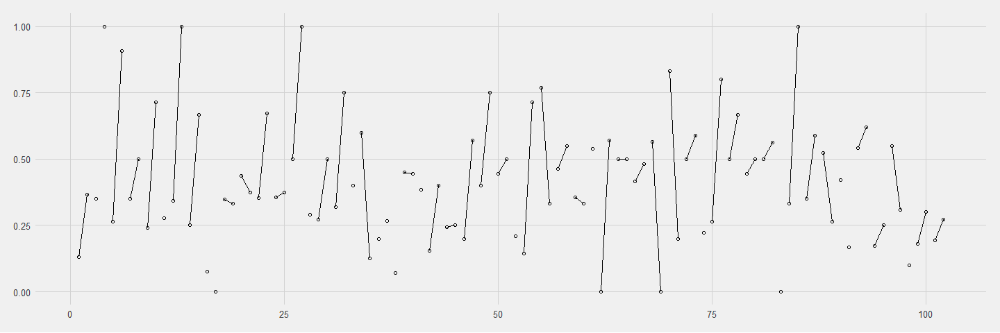

``` r
d_summary <- d%>% 
  group_by(district, urban) %>% 
  summarise(proportion = mean(use.contraception)) %>% 
  ungroup() %>% 
  mutate(x = 1:n())
```

``` r
p <- d %>% 
  ggplot(aes(x = as_factor(urban), y = use.contraception))+
  # geom_line()+
  geom_jitter(shape=1, height = 0)+
  facet_wrap(~district_id, ncol = 10)+
  theme_fivethirtyeight()+
  theme(panel.grid.major.x = element_blank())

p
```

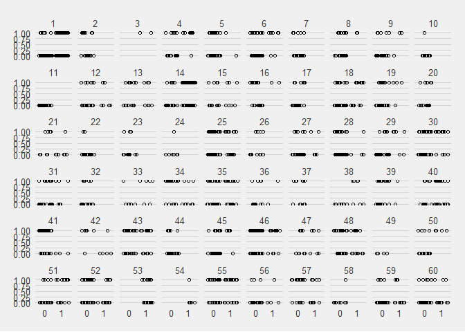

``` r
data_grid <- d %>% 
  modelr::data_grid(district_id, urban) %>% 
  rename(dist_id = district_id)
result <- link(m_contra_5, data=data_grid) %>% 
  apply(2, inv_logit) %>% 
  summarise_samples()

simulated <- cbind(data_grid, result) 
```

``` r
d_2 <- d %>% 
  rename(dist_id = district_id)
simulated %>% 
  ggplot(aes(x = as_factor(urban), y = estimate))+
  geom_jitter(data = d_2, aes(y = use.contraception), shape=1, height = 0)+
  geom_point()+
  geom_errorbar(aes(ymax = upper, ymin = lower))+
  geom_line(aes(group = dist_id))+
  facet_wrap(~dist_id, ncol = 10)+
  theme_fivethirtyeight()+
  theme(panel.grid.major.x = element_blank())
```

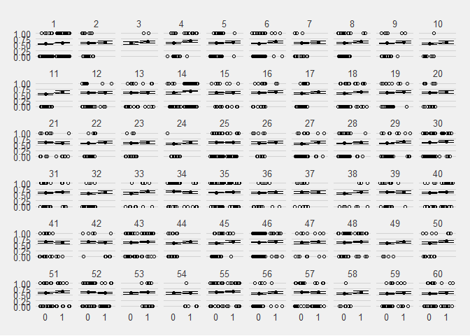

``` r
data_grid <- d %>% 
  modelr::data_grid(district_id, urban) %>% 
  rename(dist_id = district_id)
result <- sim(m_contra_5, data=data_grid) %>% 
  apply(2, inv_logit) %>% 
  summarise_samples()

simulated <- cbind(data_grid, result) 

simulated %>% 
  ggplot(aes(x = as_factor(urban), y = estimate))+
  geom_jitter(data = d_2, aes(y = use.contraception), shape=1, height = 0)+
  geom_point()+
  geom_errorbar(aes(ymax = upper, ymin = lower))+
  geom_line(aes(group = dist_id))+
  facet_wrap(~dist_id, ncol = 10)+
  theme_fivethirtyeight()+
  theme(panel.grid.major.x = element_blank())
```

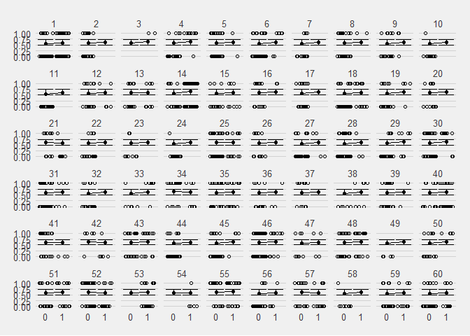

``` r
sample_trans <- d_2 %>% 
  group_by(dist_id, urban) %>% 
  summarise(proportion = mean(use.contraception)) %>% 
  ungroup() %>% 
  mutate(area = ifelse(urban == 0, "rural", "urban")) %>%
  select(-urban) %>% 
  group_by(dist_id) %>% 
  spread(area, proportion) %>% 
  replace(is.na(.), 0) %>% 
  mutate(type = "sample")
```

``` r
sample_trans %>% 
  ggplot(aes(urban, rural))+
  geom_point(shape = 1)+
  geom_abline(slope = 1, linetype = "dashed")+
  theme_fivethirtyeight()+
  labs(x = "urban", y = "rural")
```

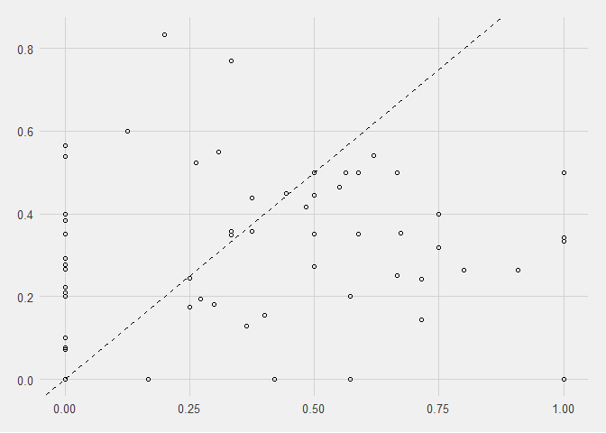

``` r
sim_trans <- simulated %>%
  select(-lower, -upper) %>%
  rename(proportion = estimate) %>%
  mutate(area = ifelse(urban == 0, "rural", "urban")) %>%
  select(-urban) %>% 
  group_by(dist_id) %>% 
  spread(area, proportion) %>% 
  mutate(type = "sim")
```

``` r
bind_rows(sample_trans, sim_trans) %>% 
  ggplot(aes(urban, rural))+
  geom_point(aes(shape = type))+
  geom_line(aes(group = dist_id), alpha=1/5)+
  geom_abline(slope = 1, linetype = "dashed")+
  theme_fivethirtyeight()+
  labs(x = "urban", y = "rural")
```

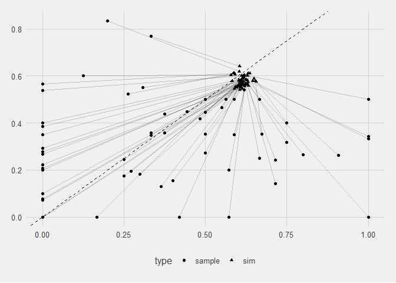 \#\#\# Model 6 using matrix instead of slopes

Prof proposed this model after previous model shown that the slope is only neccessary to encode the negative correlation pattern.

``` r
dat$uid = dat$urban + 1L
m_contra_6 <- ulam(
  alist(
    contraception ~ bernoulli(p),
    logit(p) <- a[dist_id,uid],
    vector[2]:a[dist_id] ~ multi_normal(c(r_avg, u_avg), Rho, Sigma),
    c(r_avg, u_avg) ~ dnorm(0, 1.5),
    Rho ~ lkj_corr(2),
    Sigma ~ dexp(1)
  ), data = dat, cores = 4, chains = 4
)
```

``` r
precis(m_contra_6, depth = 3)
```

    ##                  mean           sd         5.5%       94.5%     n_eff
    ## a[1,1]   -1.560604458 3.281965e-01 -2.097296607 -1.06350730 2395.0998
    ## a[1,2]   -0.408388702 2.486875e-01 -0.813401192 -0.01751396 1974.8259
    ## a[2,1]   -0.667960471 3.782231e-01 -1.268715239 -0.09135301 5047.8773
    ## a[2,2]    0.024253732 5.507551e-01 -0.854234690  0.87053264 3288.7475
    ## a[3,1]   -0.767934548 6.330587e-01 -1.762770995  0.21907096 3665.8622
    ## a[3,2]    0.309062511 5.582587e-01 -0.501593006  1.26789978 1316.9720
    ## a[4,1]   -0.951981157 4.072408e-01 -1.629287283 -0.30212804 2695.4749
    ## a[4,2]    0.748851369 5.085700e-01  0.001216102  1.59108519  718.4380
    ## a[5,1]   -0.654156924 3.087790e-01 -1.159605252 -0.16011576 4477.9612
    ## a[5,2]    0.016374873 5.104482e-01 -0.735797016  0.82165109 2917.8286
    ## a[6,1]   -1.086506192 2.635043e-01 -1.524337264 -0.67299973 3836.8711
    ## a[6,2]    0.332433671 4.664092e-01 -0.370466267  1.13405032 1268.5599
    ## a[7,1]   -0.868315267 4.163945e-01 -1.552086555 -0.22058812 4678.3726
    ## a[7,2]    0.046064081 5.689770e-01 -0.854052698  0.93457639 3079.3320
    ## a[8,1]   -0.688969229 3.129897e-01 -1.190292007 -0.19109604 4155.1339
    ## a[8,2]    0.293715728 5.458814e-01 -0.509299641  1.20030136 1398.5285
    ## a[9,1]   -0.963955049 4.012748e-01 -1.635187441 -0.33396019 3750.3679
    ## a[9,2]    0.168924555 5.081251e-01 -0.630598413  1.00036527 2072.3765
    ## a[10,1]  -1.385230140 4.939859e-01 -2.178561349 -0.64343200 2637.7038
    ## a[10,2]   0.108961407 5.855252e-01 -0.805049107  1.05215331 1612.4304
    ## a[11,1]  -1.875094701 4.945263e-01 -2.679654363 -1.14283093 1848.9921
    ## a[11,2]   0.168251929 6.428450e-01 -0.804049113  1.22235424 1053.2331
    ## a[12,1]  -0.650057456 3.465528e-01 -1.185926379 -0.10685317 4033.4419
    ## a[12,2]  -0.196654893 4.711899e-01 -1.001900645  0.50102612 2462.8760
    ## a[13,1]  -0.450329152 3.961316e-01 -1.069713971  0.18488259 3686.3367
    ## a[13,2]  -0.171632395 4.471175e-01 -0.899345610  0.52025671 3079.0156
    ## a[14,1]  -0.699159792 4.056403e-01 -1.364188696 -0.07008817 3274.7676
    ## a[14,2]   0.611461600 2.000330e-01  0.295920831  0.92737618 2013.4859
    ## a[15,1]  -0.649188897 4.158984e-01 -1.333914577  0.04085140 3119.1740
    ## a[15,2]  -0.175927430 4.222905e-01 -0.849728097  0.49639772 2263.2004
    ## a[16,1]  -0.299224208 3.908771e-01 -0.908133385  0.32793657 3796.3533
    ## a[16,2]   0.244383887 5.404053e-01 -0.580466811  1.10211715 1512.4325
    ## a[17,1]  -0.851749582 3.576390e-01 -1.417929711 -0.29039723 5171.8058
    ## a[17,2]   0.040440780 5.836454e-01 -0.877984583  0.95820886 1867.7861
    ## a[18,1]  -0.910791564 3.149312e-01 -1.430543223 -0.41491479 4201.6039
    ## a[18,2]   0.019472979 3.674866e-01 -0.576967989  0.60157370 2599.5693
    ## a[19,1]  -0.770789673 3.690589e-01 -1.373487737 -0.18572430 4145.4359
    ## a[19,2]   0.253920890 5.037362e-01 -0.496926574  1.08949929 1417.9551
    ## a[20,1]  -0.551609566 4.199996e-01 -1.215366573  0.10924043 4716.0568
    ## a[20,2]   0.023829101 5.820546e-01 -0.865053290  0.93406142 2192.9869
    ## a[21,1]  -0.136308007 4.630410e-01 -0.878046076  0.63441547 3147.2540
    ## a[21,2]  -0.579174995 4.832270e-01 -1.414902118  0.13050125  953.7871
    ## a[22,1]  -1.118400425 4.077806e-01 -1.789945576 -0.49527150 3529.3313
    ## a[22,2]   0.061245257 5.662208e-01 -0.845176657  0.94695625 2480.2678
    ## a[23,1]  -0.888510838 4.309223e-01 -1.595129231 -0.23279032 4328.5502
    ## a[23,2]   0.047947587 5.581875e-01 -0.810525606  0.93495149 2104.4473
    ## a[24,1]  -1.427030513 4.931879e-01 -2.273338746 -0.68280134 2220.4527
    ## a[24,2]   0.099801971 5.783372e-01 -0.807457527  1.02296249 1782.0792
    ## a[25,1]  -0.301245363 2.737316e-01 -0.735269151  0.13066437 6768.9736
    ## a[25,2]  -0.124377704 3.415135e-01 -0.682004283  0.40826312 3572.6255
    ## a[26,1]  -0.597852725 4.475283e-01 -1.310772725  0.10454338 3315.0010
    ## a[26,2]   0.009820555 5.664106e-01 -0.880915675  0.86244606 2900.8874
    ## a[27,1]  -1.388613665 3.358147e-01 -1.930009903 -0.85074249 2759.7645
    ## a[27,2]  -0.034739143 4.981138e-01 -0.815874921  0.73525089 1941.0284
    ## a[28,1]  -1.036174920 3.073855e-01 -1.528768537 -0.55829223 3815.2235
    ## a[28,2]  -0.175926583 4.989685e-01 -1.001332690  0.60951988 2805.0186
    ## a[29,1]  -1.153975937 3.724668e-01 -1.788963692 -0.56305579 4206.2567
    ## a[29,2]   0.144553291 4.638636e-01 -0.578510667  0.92090823 2542.9028
    ## a[30,1]  -0.490752192 2.689818e-01 -0.925793393 -0.08381126 4860.0297
    ## a[30,2]   0.526981366 4.111584e-01 -0.086512324  1.24211144 1234.4450
    ## a[31,1]  -0.377936993 3.255768e-01 -0.896700852  0.13950531 4162.2426
    ## a[31,2]  -0.006343656 4.587370e-01 -0.727848447  0.72367036 3463.5766
    ## a[32,1]  -1.119897544 3.834333e-01 -1.727763620 -0.51613981 3940.8545
    ## a[32,2]   0.081651137 6.074920e-01 -0.849977529  1.03290759 2176.5189
    ## a[33,1]  -1.070558506 5.175536e-01 -1.927299979 -0.24504857 3659.6067
    ## a[33,2]   0.326106419 4.891889e-01 -0.385063212  1.13024063 1257.9510
    ## a[34,1]   0.577019622 3.693049e-01  0.012944998  1.17620674 2457.1800
    ## a[34,2]  -0.335972136 4.782911e-01 -1.135162922  0.39026589 1015.1751
    ## a[35,1]  -0.327541709 3.321364e-01 -0.868081366  0.19696540 5989.7771
    ## a[35,2]   0.114090522 3.480299e-01 -0.444448536  0.68007728 3898.9209
    ## a[36,1]  -0.646264187 4.416056e-01 -1.379576441  0.03606856 3937.1328
    ## a[36,2]  -0.103598175 4.980271e-01 -0.908203500  0.68428621 2990.8922
    ## a[37,1]  -0.253618932 4.213417e-01 -0.933130201  0.42882184 4502.3433
    ## a[37,2]  -0.009567243 5.725099e-01 -0.913051106  0.90764516 3376.0919
    ## a[38,1]  -1.327289770 5.428120e-01 -2.216366102 -0.51975785 2612.0717
    ## a[38,2]   0.165463700 4.874835e-01 -0.589801761  0.94571568 2107.0231
    ## a[39,1]  -0.234540110 3.501791e-01 -0.795709887  0.30638582 5500.0682
    ## a[39,2]  -0.025402224 5.510470e-01 -0.890609490  0.83449963 3146.8686
    ## a[40,1]  -0.522623167 4.309284e-01 -1.208166536  0.17159967 5044.7686
    ## a[40,2]  -0.043420074 3.056652e-01 -0.512754282  0.43049719 4379.6114
    ## a[41,1]  -0.038967160 3.384057e-01 -0.567315551  0.50760144 4239.4424
    ## a[41,2]  -0.399821247 5.556966e-01 -1.337075199  0.43697789  935.3113
    ## a[42,1]   0.049473122 5.222134e-01 -0.773446445  0.91774356 2510.6636
    ## a[42,2]  -0.363552109 5.131641e-01 -1.221669302  0.38797814 1332.7829
    ## a[43,1]  -0.213481205 3.436255e-01 -0.756877985  0.34341652 4278.8183
    ## a[43,2]   0.175913932 3.756082e-01 -0.428684929  0.77820501 3749.1720
    ## a[44,1]  -1.089209964 3.607653e-01 -1.700560888 -0.52662524 4783.5066
    ## a[44,2]   0.061400621 5.811893e-01 -0.846366958  0.96102177 2083.1989
    ## a[45,1]  -0.958134420 3.191426e-01 -1.480789496 -0.46085220 4383.3939
    ## a[45,2]   0.346357270 4.739061e-01 -0.363278627  1.13778835 1446.2381
    ## a[46,1]  -0.102282779 2.165525e-01 -0.440336877  0.23632174 3862.9300
    ## a[46,2]   0.281213387 4.216143e-01 -0.369957312  0.96196695 2566.4103
    ## a[47,1]  -0.497378909 4.562934e-01 -1.238737857  0.21569897 4488.8834
    ## a[47,2]   0.007446240 4.521912e-01 -0.702888007  0.74723954 3249.8614
    ## a[48,1]  -0.238171252 3.547352e-01 -0.789790182  0.34696767 4565.9457
    ## a[48,2]   0.118491257 3.786186e-01 -0.476256835  0.72399126 2466.7576
    ## a[49,1]  -1.139016769 5.792839e-01 -2.096822096 -0.28384735 2855.3246
    ## a[49,2]   0.066196892 5.907955e-01 -0.889126238  0.98144714 1894.2916
    ## a[50,1]  -0.749016215 4.127677e-01 -1.415555953 -0.09515339 3783.4706
    ## a[50,2]   0.473650027 5.329052e-01 -0.308889363  1.42172560 1049.5526
    ## a[51,1]  -0.685282444 3.858155e-01 -1.303889488 -0.06312775 4110.7897
    ## a[51,2]   0.201820212 3.497920e-01 -0.315845526  0.77850409 2607.2659
    ## a[52,1]  -0.060870697 2.853097e-01 -0.513380616  0.37619196 3978.9241
    ## a[52,2]  -0.555186038 3.802069e-01 -1.202971485  0.03501176 1059.6979
    ## a[53,1]  -0.671687455 6.465240e-01 -1.676353565  0.36196685 3303.4998
    ## a[53,2]  -0.177098129 3.532122e-01 -0.750918445  0.37695027 3016.3150
    ## a[54,1]  -0.662225447 6.505530e-01 -1.713001760  0.37816467 2575.2634
    ## a[54,2]  -0.394982510 4.852295e-01 -1.197746484  0.32766508 1220.5101
    ## a[55,1]  -0.132388227 3.518988e-01 -0.710521619  0.43595878 4201.4197
    ## a[55,2]   0.267517060 3.694643e-01 -0.301469840  0.86701631 3069.3009
    ## a[56,1]  -1.206774649 4.233052e-01 -1.901162117 -0.57760762 3441.4144
    ## a[56,2]  -0.159625315 5.249753e-01 -1.021255168  0.65499021 2296.2039
    ## a[57,1]  -0.111140003 3.672459e-01 -0.693065526  0.45714415 3691.8422
    ## a[57,2]  -0.375146923 4.006257e-01 -1.045737887  0.23719164 1910.2120
    ## a[58,1]  -1.239140270 5.032965e-01 -2.072097287 -0.45857443 3352.5049
    ## a[58,2]   0.075288188 5.911716e-01 -0.856562203  1.02406404 2085.2453
    ## a[59,1]  -1.164211149 3.881354e-01 -1.793647983 -0.56750265 2931.6099
    ## a[59,2]  -0.283426534 4.417605e-01 -0.996402180  0.38876453 1547.7496
    ## a[60,1]  -1.184161760 3.465939e-01 -1.745843076 -0.65982793 3539.3686
    ## a[60,2]  -0.342260096 4.398525e-01 -1.051513630  0.32817987 1671.5947
    ## u_avg     0.025708659 1.372486e-01 -0.187523534  0.24888385  808.8041
    ## r_avg    -0.719702381 1.081743e-01 -0.894151952 -0.55165401 2087.9914
    ## Rho[1,1]  1.000000000 0.000000e+00  1.000000000  1.00000000       NaN
    ## Rho[1,2] -0.111854195 2.706471e-01 -0.532722823  0.34742393  536.4492
    ## Rho[2,1] -0.111854195 2.706471e-01 -0.532722823  0.34742393  536.4492
    ## Rho[2,2]  1.000000000 8.929006e-17  1.000000000  1.00000000 1788.3480
    ## Sigma[1]  0.623684003 1.048530e-01  0.469687884  0.79802657  706.3683
    ## Sigma[2]  0.544123719 1.530231e-01  0.320159215  0.81290523  195.8108
    ##               Rhat
    ## a[1,1]   1.0002533
    ## a[1,2]   1.0005648
    ## a[2,1]   0.9985969
    ## a[2,2]   0.9994694
    ## a[3,1]   0.9995546
    ## a[3,2]   1.0050943
    ## a[4,1]   0.9986351
    ## a[4,2]   1.0116175
    ## a[5,1]   0.9989340
    ## a[5,2]   0.9984215
    ## a[6,1]   0.9999818
    ## a[6,2]   1.0040289
    ## a[7,1]   0.9985507
    ## a[7,2]   0.9998846
    ## a[8,1]   0.9992300
    ## a[8,2]   1.0041387
    ## a[9,1]   0.9988627
    ## a[9,2]   1.0006627
    ## a[10,1]  1.0001549
    ## a[10,2]  1.0007582
    ## a[11,1]  1.0037552
    ## a[11,2]  1.0024311
    ## a[12,1]  0.9982959
    ## a[12,2]  1.0005718
    ## a[13,1]  0.9991638
    ## a[13,2]  0.9995693
    ## a[14,1]  0.9993573
    ## a[14,2]  1.0032941
    ## a[15,1]  0.9995119
    ## a[15,2]  0.9993204
    ## a[16,1]  0.9987497
    ## a[16,2]  1.0012481
    ## a[17,1]  0.9988481
    ## a[17,2]  1.0024187
    ## a[18,1]  0.9990509
    ## a[18,2]  0.9991407
    ## a[19,1]  0.9986746
    ## a[19,2]  1.0043103
    ## a[20,1]  0.9987739
    ## a[20,2]  1.0007182
    ## a[21,1]  0.9984491
    ## a[21,2]  1.0081255
    ## a[22,1]  0.9993983
    ## a[22,2]  1.0006583
    ## a[23,1]  0.9988133
    ## a[23,2]  0.9999160
    ## a[24,1]  1.0008633
    ## a[24,2]  1.0020274
    ## a[25,1]  0.9981690
    ## a[25,2]  0.9994787
    ## a[26,1]  0.9986870
    ## a[26,2]  0.9987743
    ## a[27,1]  1.0002115
    ## a[27,2]  1.0006785
    ## a[28,1]  0.9989086
    ## a[28,2]  0.9999822
    ## a[29,1]  0.9985695
    ## a[29,2]  0.9995809
    ## a[30,1]  0.9989906
    ## a[30,2]  1.0058386
    ## a[31,1]  0.9987340
    ## a[31,2]  0.9983684
    ## a[32,1]  0.9983142
    ## a[32,2]  1.0005368
    ## a[33,1]  0.9987617
    ## a[33,2]  1.0023303
    ## a[34,1]  0.9999465
    ## a[34,2]  1.0051185
    ## a[35,1]  0.9994929
    ## a[35,2]  0.9995176
    ## a[36,1]  0.9996588
    ## a[36,2]  0.9993680
    ## a[37,1]  0.9984658
    ## a[37,2]  0.9986627
    ## a[38,1]  0.9983849
    ## a[38,2]  1.0003170
    ## a[39,1]  0.9982593
    ## a[39,2]  1.0003892
    ## a[40,1]  0.9983758
    ## a[40,2]  0.9987201
    ## a[41,1]  0.9987187
    ## a[41,2]  1.0079497
    ## a[42,1]  0.9993498
    ## a[42,2]  1.0043237
    ## a[43,1]  1.0000605
    ## a[43,2]  0.9994019
    ## a[44,1]  0.9992797
    ## a[44,2]  1.0010443
    ## a[45,1]  0.9994806
    ## a[45,2]  1.0029630
    ## a[46,1]  0.9985905
    ## a[46,2]  1.0015276
    ## a[47,1]  0.9984508
    ## a[47,2]  0.9990918
    ## a[48,1]  0.9982375
    ## a[48,2]  0.9993631
    ## a[49,1]  0.9995021
    ## a[49,2]  0.9987152
    ## a[50,1]  0.9985758
    ## a[50,2]  1.0076063
    ## a[51,1]  0.9987807
    ## a[51,2]  1.0021010
    ## a[52,1]  0.9992646
    ## a[52,2]  1.0065882
    ## a[53,1]  0.9993149
    ## a[53,2]  1.0004705
    ## a[54,1]  0.9994347
    ## a[54,2]  1.0057519
    ## a[55,1]  0.9987960
    ## a[55,2]  0.9999534
    ## a[56,1]  0.9985608
    ## a[56,2]  0.9995032
    ## a[57,1]  0.9988249
    ## a[57,2]  1.0033400
    ## a[58,1]  0.9985051
    ## a[58,2]  0.9999429
    ## a[59,1]  0.9987478
    ## a[59,2]  1.0014197
    ## a[60,1]  0.9995406
    ## a[60,2]  1.0002531
    ## u_avg    1.0064920
    ## r_avg    0.9995628
    ## Rho[1,1]       NaN
    ## Rho[1,2] 1.0040193
    ## Rho[2,1] 1.0040193
    ## Rho[2,2] 0.9979980
    ## Sigma[1] 1.0059807
    ## Sigma[2] 1.0492213

### Model 7 causal inference of age and living children

``` r
dat <- with(d,
            list(dist_id = district_id,
                 contraception = use.contraception %>% as.integer(),
                 urban = urban %>% as.integer(),
                 age = age.centered,
                 children = living.children
                )
            )
```

``` r
m_contra_7 <- ulam(
  alist(
    contraception ~ bernoulli(p),
    logit(p) <- a[dist_id] + b[dist_id] * urban + bAge * age + bC * children + bAC * age * children,
    c(a, b)[dist_id] ~ multi_normal(c(mu_a, mu_b), Rho, Sigma),
    mu_a ~ dnorm(0, 1.5),
    mu_b ~ dnorm(0, 0.5),
    c(bAge, bC, bAC) ~ dnorm(0, 0.5),
    Sigma ~ dexp(1),
    Rho ~ lkj_corr(2)
  ),
  data = dat, core = 4, chains = 4
)
```

``` r
precis(m_contra_7, depth = 3)
```

    ##                 mean           sd        5.5%       94.5%     n_eff
    ## b[1]      1.14429539 3.922667e-01  0.52282319  1.77354433 1212.1531
    ## b[2]      0.71312741 6.670235e-01 -0.28611752  1.80068497 2839.7959
    ## b[3]      0.89958611 7.531093e-01 -0.24483401  2.17025568 1701.7132
    ## b[4]      1.53422441 6.390389e-01  0.59069386  2.62461210  584.5757
    ## b[5]      0.67336223 5.918656e-01 -0.25697915  1.58759685 2627.3650
    ## b[6]      1.29600589 5.321819e-01  0.50315732  2.18688699  904.5116
    ## b[7]      0.81506504 6.693215e-01 -0.18307974  1.88978832 2161.7117
    ## b[8]      0.92878942 6.021495e-01  0.03688631  1.93229222 1826.2078
    ## b[9]      1.08859424 6.246517e-01  0.16028357  2.13138379 1389.0754
    ## b[10]     1.15798279 7.172914e-01  0.06017785  2.35753771 1360.3341
    ## b[11]     1.46086208 7.946587e-01  0.32845794  2.78165275 1165.1162
    ## b[12]     0.49742437 5.677912e-01 -0.41218819  1.37863104 2176.7017
    ## b[13]     0.46151428 5.480721e-01 -0.41023790  1.32035755 1949.4685
    ## b[14]     1.29388803 4.555255e-01  0.60173585  2.04534952  762.8370
    ## b[15]     0.42097583 6.016786e-01 -0.56198072  1.34252083 2197.8138
    ## b[16]     0.45835984 6.444504e-01 -0.55253311  1.48768247 2015.3342
    ## b[17]     0.86949287 6.661396e-01 -0.16694404  1.92778100 2037.3714
    ## b[18]     1.00719699 4.958522e-01  0.26245499  1.82360327 1462.4548
    ## b[19]     1.01265069 5.905790e-01  0.09800685  1.97014503 1746.8592
    ## b[20]     0.50484538 6.865239e-01 -0.59668269  1.57182683 2536.9036
    ## b[21]    -0.25749628 6.950259e-01 -1.46648591  0.76957350  741.1501
    ## b[22]     1.10800017 7.006948e-01  0.02147307  2.23934873 1414.4605
    ## b[23]     0.86187462 6.717992e-01 -0.19434648  1.94770976 2053.8828
    ## b[24]     1.21923749 7.370886e-01  0.05832109  2.42469168 1222.9541
    ## b[25]     0.36161119 4.398535e-01 -0.36479863  1.05670629 1963.3151
    ## b[26]     0.63052431 6.901728e-01 -0.46763970  1.75007424 2087.0959
    ## b[27]     1.07605406 5.803505e-01  0.20475024  2.02524454 1354.6139
    ## b[28]     0.65074175 5.502722e-01 -0.24703678  1.51930626 2156.1045
    ## b[29]     1.09089138 5.682687e-01  0.24422962  2.05513898 1747.4863
    ## b[30]     0.94287261 4.727351e-01  0.22340867  1.70590784 1641.5236
    ## b[31]     0.38839490 5.386690e-01 -0.47261192  1.24266190 2413.3037
    ## b[32]     1.13051415 6.922198e-01  0.09908718  2.28363165 1498.6884
    ## b[33]     1.15978175 6.371403e-01  0.22488893  2.20464065 1170.4566
    ## b[34]    -0.52440999 6.162590e-01 -1.54185519  0.39859114  490.7078
    ## b[35]     0.60673235 4.568898e-01 -0.13872413  1.34493936 2323.1083
    ## b[36]     0.61783071 6.096281e-01 -0.35430337  1.55933546 2167.5495
    ## b[37]     0.34043870 6.656521e-01 -0.75480677  1.38209524 2072.3306
    ## b[38]     1.19264885 6.699956e-01  0.19670193  2.31549319 1371.9044
    ## b[39]     0.24165096 6.269778e-01 -0.76824777  1.20927355 1981.0716
    ## b[40]     0.59771897 4.974319e-01 -0.17816218  1.36761556 2099.5467
    ## b[41]    -0.15926659 6.377727e-01 -1.25425857  0.76792612  731.1797
    ## b[42]    -0.22528055 7.412323e-01 -1.49147766  0.83622222 1062.9826
    ## b[43]     0.35629931 4.881014e-01 -0.41929321  1.12205870 2231.9470
    ## b[44]     1.00227019 6.938513e-01 -0.05281786  2.17347694 2080.8687
    ## b[45]     1.27675058 5.984430e-01  0.42982446  2.30506161  896.6635
    ## b[46]     0.50913577 4.746137e-01 -0.24288660  1.27749634 2314.1432
    ## b[47]     0.59784480 6.058492e-01 -0.37343968  1.54129537 2121.3145
    ## b[48]     0.35081775 4.865248e-01 -0.42300058  1.09414341 1862.0500
    ## b[49]     0.94885323 7.812940e-01 -0.28185195  2.16783211 2299.5286
    ## b[50]     1.06313206 6.724346e-01  0.10292228  2.23804471 1232.8549
    ## b[51]     0.78558956 5.065018e-01 -0.01722952  1.62067648 2211.9450
    ## b[52]    -0.28417505 4.909006e-01 -1.08662801  0.49452002  739.1718
    ## b[53]     0.53546617 6.782722e-01 -0.55879698  1.56788789 2159.6390
    ## b[54]     0.33368279 7.436389e-01 -0.89078522  1.47032726 1341.8584
    ## b[55]     0.47078734 4.708531e-01 -0.27911571  1.24182338 2154.3694
    ## b[56]     0.84710716 6.036340e-01 -0.14316352  1.78380852 2173.0084
    ## b[57]    -0.20233323 5.645718e-01 -1.11341445  0.64841409  753.8722
    ## b[58]     1.12605204 7.359375e-01 -0.01140648  2.36747250 1672.7751
    ## b[59]     0.80824777 5.686891e-01 -0.08181636  1.71466994 1795.1424
    ## b[60]     0.77844400 5.474154e-01 -0.11016299  1.62383764 1910.8416
    ## a[1]     -2.48644351 3.771413e-01 -3.08687547 -1.88916904  486.8705
    ## a[2]     -1.51601060 4.244485e-01 -2.21567397 -0.86359770  918.0460
    ## a[3]     -1.40804317 6.456102e-01 -2.46052906 -0.38190725 1471.6568
    ## a[4]     -1.65725803 4.535866e-01 -2.39862319 -0.96301816  943.8106
    ## a[5]     -1.45562530 3.594992e-01 -2.06567865 -0.89172634  646.1318
    ## a[6]     -1.85851564 3.211022e-01 -2.38905618 -1.34647381  560.2375
    ## a[7]     -1.65676312 4.298572e-01 -2.37919695 -1.00413503  695.6557
    ## a[8]     -1.40894132 3.589455e-01 -1.97962611 -0.83463728  770.1967
    ## a[9]     -1.84110418 4.328191e-01 -2.53893951 -1.18271405  919.2185
    ## a[10]    -2.07035660 5.063115e-01 -2.93657424 -1.28027455 1080.2150
    ## a[11]    -2.48596979 5.234253e-01 -3.35332220 -1.68260874  573.2342
    ## a[12]    -1.53161404 4.110174e-01 -2.21148894 -0.87307585  901.4147
    ## a[13]    -1.31472436 4.306635e-01 -1.97903867 -0.65203407  967.5935
    ## a[14]    -1.33718499 4.412203e-01 -2.04586755 -0.66993103  671.8001
    ## a[15]    -1.39159942 4.601583e-01 -2.09974184 -0.64928627 1743.0291
    ## a[16]    -0.81451035 4.172286e-01 -1.47700227 -0.13950467 1549.6714
    ## a[17]    -1.73966515 4.128676e-01 -2.40817827 -1.09545035  629.9908
    ## a[18]    -1.71011296 3.761277e-01 -2.32186453 -1.10748083  585.8210
    ## a[19]    -1.54764561 4.002620e-01 -2.19594077 -0.92443188  868.7525
    ## a[20]    -1.23845295 4.375752e-01 -1.95954454 -0.56009577 1028.5666
    ## a[21]    -0.98161502 5.011015e-01 -1.77761550 -0.17020107 1110.6197
    ## a[22]    -2.01061807 4.417874e-01 -2.74947000 -1.31470260  895.5829
    ## a[23]    -1.71425268 4.591027e-01 -2.48365829 -1.00523940  997.7786
    ## a[24]    -2.15998156 5.183655e-01 -3.03528340 -1.37794741  854.6397
    ## a[25]    -1.18759823 3.174308e-01 -1.69847857 -0.68531675  652.6309
    ## a[26]    -1.40591487 4.644348e-01 -2.13384304 -0.66650645 1367.3941
    ## a[27]    -2.04767998 3.806826e-01 -2.65056761 -1.44937483  797.5068
    ## a[28]    -1.78610747 3.420792e-01 -2.34517508 -1.26699268  725.0516
    ## a[29]    -1.80082435 4.252860e-01 -2.49011394 -1.12832622  980.9343
    ## a[30]    -1.10179437 3.142143e-01 -1.60387056 -0.59248178  952.2834
    ## a[31]    -1.07489421 3.564565e-01 -1.63653058 -0.51773653 1115.9396
    ## a[32]    -2.06438059 4.274106e-01 -2.77083191 -1.38298272  746.0968
    ## a[33]    -1.76338768 5.104212e-01 -2.62165765 -0.99226331 1081.2154
    ## a[34]    -0.32517316 3.962903e-01 -0.94010648  0.33979152  913.5449
    ## a[35]    -1.22332653 3.696692e-01 -1.78771815 -0.62044220  645.2473
    ## a[36]    -1.52742016 4.457294e-01 -2.23065791 -0.82950041 1088.4560
    ## a[37]    -1.02130082 4.369106e-01 -1.72907004 -0.33544736 1305.5230
    ## a[38]    -1.95521697 5.669706e-01 -2.88440649 -1.08341659  743.6410
    ## a[39]    -0.93508944 3.941597e-01 -1.56067431 -0.31621570  860.0375
    ## a[40]    -1.33832617 4.476782e-01 -2.05144143 -0.61001554  801.3904
    ## a[41]    -0.92541711 3.820442e-01 -1.54589106 -0.32616925 1129.3894
    ## a[42]    -0.75692219 5.441932e-01 -1.61087022  0.14645401 1370.1658
    ## a[43]    -0.83800839 3.739202e-01 -1.43812474 -0.25178335 1190.9556
    ## a[44]    -1.88234908 4.063088e-01 -2.54575869 -1.26865333  785.1934
    ## a[45]    -1.79366427 3.786569e-01 -2.41639797 -1.20226541  647.3899
    ## a[46]    -0.89152067 2.774459e-01 -1.34239428 -0.44992926  623.1562
    ## a[47]    -1.27753280 4.712617e-01 -2.04590301 -0.51319859 1858.4873
    ## a[48]    -0.88462938 3.610798e-01 -1.46276248 -0.29970509  917.9207
    ## a[49]    -1.79937480 6.162357e-01 -2.84433179 -0.84299593 1494.4930
    ## a[50]    -1.35572904 4.551099e-01 -2.08625782 -0.62285676 1087.5334
    ## a[51]    -1.45328637 4.175432e-01 -2.14253679 -0.79809157  846.8894
    ## a[52]    -0.88501929 3.378645e-01 -1.42740073 -0.35652168  762.1486
    ## a[53]    -1.52014138 6.411350e-01 -2.53104936 -0.52809421 1669.8645
    ## a[54]    -1.59401710 6.542839e-01 -2.63004843 -0.53580043 1298.7159
    ## a[55]    -0.75879949 3.813600e-01 -1.35826235 -0.15512101 1070.9099
    ## a[56]    -1.99437199 4.364251e-01 -2.70777056 -1.32582821  625.1029
    ## a[57]    -0.81883636 3.994239e-01 -1.44344473 -0.17738343 1112.5645
    ## a[58]    -2.04796917 5.431316e-01 -2.91793707 -1.22501644  909.5158
    ## a[59]    -1.95814308 4.342831e-01 -2.65630538 -1.27739767  769.0563
    ## a[60]    -2.01660324 4.052327e-01 -2.66964395 -1.38705752  729.4699
    ## mu_a     -1.46915615 1.970487e-01 -1.78498116 -1.15928283  257.6405
    ## mu_b      0.67946052 1.642296e-01  0.42859713  0.94524360 1006.0165
    ## bAC      -0.02752489 5.658836e-03 -0.03655644 -0.01859966 1133.6188
    ## bC        0.36069754 5.719388e-02  0.27050773  0.45637894  242.7437
    ## bAge      0.05094221 1.799491e-02  0.02302808  0.08022240  570.5178
    ## Sigma[1]  0.61400620 1.025463e-01  0.45989964  0.78639116  377.4042
    ## Sigma[2]  0.73644658 2.073474e-01  0.40596199  1.08039774  168.5921
    ## Rho[1,1]  1.00000000 0.000000e+00  1.00000000  1.00000000       NaN
    ## Rho[1,2] -0.63297261 1.692508e-01 -0.84649868 -0.32669900  436.4711
    ## Rho[2,1] -0.63297261 1.692508e-01 -0.84649868 -0.32669900  436.4711
    ## Rho[2,2]  1.00000000 6.153016e-17  1.00000000  1.00000000 2014.6503
    ##               Rhat
    ## b[1]     1.0000957
    ## b[2]     0.9998445
    ## b[3]     1.0002746
    ## b[4]     1.0058249
    ## b[5]     0.9989923
    ## b[6]     1.0030917
    ## b[7]     1.0015838
    ## b[8]     1.0015183
    ## b[9]     1.0022861
    ## b[10]    1.0003418
    ## b[11]    1.0017365
    ## b[12]    0.9995944
    ## b[13]    0.9997877
    ## b[14]    1.0054995
    ## b[15]    0.9990937
    ## b[16]    0.9998939
    ## b[17]    0.9990664
    ## b[18]    1.0014912
    ## b[19]    1.0020005
    ## b[20]    0.9986651
    ## b[21]    1.0041892
    ## b[22]    1.0049928
    ## b[23]    0.9997155
    ## b[24]    1.0027488
    ## b[25]    0.9994403
    ## b[26]    0.9991584
    ## b[27]    1.0016315
    ## b[28]    0.9992386
    ## b[29]    1.0018604
    ## b[30]    1.0011470
    ## b[31]    1.0003749
    ## b[32]    1.0021893
    ## b[33]    1.0034245
    ## b[34]    1.0084728
    ## b[35]    0.9990160
    ## b[36]    1.0020813
    ## b[37]    0.9995042
    ## b[38]    1.0016368
    ## b[39]    1.0024628
    ## b[40]    0.9997166
    ## b[41]    1.0041329
    ## b[42]    1.0019325
    ## b[43]    1.0006963
    ## b[44]    0.9997893
    ## b[45]    1.0060677
    ## b[46]    0.9995980
    ## b[47]    0.9993081
    ## b[48]    0.9996463
    ## b[49]    0.9997172
    ## b[50]    1.0009570
    ## b[51]    1.0018168
    ## b[52]    1.0032483
    ## b[53]    0.9989120
    ## b[54]    1.0004514
    ## b[55]    0.9999407
    ## b[56]    1.0007768
    ## b[57]    1.0033961
    ## b[58]    1.0021135
    ## b[59]    0.9998565
    ## b[60]    1.0001402
    ## a[1]     1.0048169
    ## a[2]     1.0024460
    ## a[3]     1.0012219
    ## a[4]     1.0044952
    ## a[5]     1.0054609
    ## a[6]     1.0073804
    ## a[7]     1.0080089
    ## a[8]     1.0045974
    ## a[9]     1.0047874
    ## a[10]    1.0050232
    ## a[11]    1.0040584
    ## a[12]    1.0031508
    ## a[13]    1.0012603
    ## a[14]    1.0077215
    ## a[15]    0.9994615
    ## a[16]    1.0016382
    ## a[17]    1.0047791
    ## a[18]    1.0049277
    ## a[19]    1.0029138
    ## a[20]    1.0002844
    ## a[21]    1.0039527
    ## a[22]    1.0044693
    ## a[23]    1.0014436
    ## a[24]    1.0012102
    ## a[25]    1.0006442
    ## a[26]    0.9994750
    ## a[27]    1.0044357
    ## a[28]    1.0028563
    ## a[29]    1.0022436
    ## a[30]    1.0031990
    ## a[31]    1.0047207
    ## a[32]    1.0039215
    ## a[33]    1.0036850
    ## a[34]    1.0037735
    ## a[35]    1.0083051
    ## a[36]    1.0036431
    ## a[37]    1.0035958
    ## a[38]    1.0068758
    ## a[39]    1.0045289
    ## a[40]    1.0035311
    ## a[41]    1.0007690
    ## a[42]    1.0004305
    ## a[43]    1.0041752
    ## a[44]    1.0014007
    ## a[45]    1.0009501
    ## a[46]    1.0049620
    ## a[47]    0.9996439
    ## a[48]    1.0040187
    ## a[49]    0.9999992
    ## a[50]    1.0025278
    ## a[51]    1.0025600
    ## a[52]    1.0030156
    ## a[53]    0.9993820
    ## a[54]    1.0005017
    ## a[55]    1.0051420
    ## a[56]    1.0016442
    ## a[57]    1.0019863
    ## a[58]    1.0013204
    ## a[59]    1.0034184
    ## a[60]    1.0012950
    ## mu_a     1.0127380
    ## mu_b     1.0057668
    ## bAC      1.0022315
    ## bC       1.0129931
    ## bAge     1.0040906
    ## Sigma[1] 1.0060122
    ## Sigma[2] 1.0216280
    ## Rho[1,1]       NaN
    ## Rho[1,2] 1.0063635
    ## Rho[2,1] 1.0063635
    ## Rho[2,2] 0.9979980

the interaction model showed older women actually use contraception more, after the impact of the interaction with \# of living children had been isolated. this makes more sense as it is more dangerous for older women to have children.

### Model 8 causal inference of age and living children without interaction

``` r
dat_list <- with(dat,
                 list(
                   C = contraception,
                   did = dist_id,
                   urban = urban,
                   age = standardize(age),
                   children = standardize(children)
                 )
                 )
m_contra_8 <- ulam(
  alist(
    C ~ bernoulli(p),
    logit(p) <- a[did] + b[did] * urban + bAge * age + bK * children,
    c(a, b)[did] ~ multi_normal(c(mu_a, mu_b), Rho, Sigma),
    mu_a ~ dnorm(0, 1),
    mu_b ~ dnorm(0, 0.5),
    c(bAge, bK) ~ dnorm(0, 0.5),
    Sigma ~ dexp(1),
    Rho ~ lkj_corr(2)
  ),
  data = dat_list, core = 4, chains = 4
)
```

``` r
precis(m_contra_8)
```

    ## 126 vector or matrix parameters hidden. Use depth=2 to show them.

    ##            mean         sd       5.5%      94.5%    n_eff      Rhat
    ## mu_a -0.7176625 0.10121213 -0.8801442 -0.5535645 1357.385 1.0025352
    ## mu_b  0.6947365 0.16245607  0.4384954  0.9600988 1037.016 1.0020852
    ## bK    0.5150209 0.06810827  0.4042120  0.6238385 2014.720 0.9999514
    ## bAge -0.2653209 0.06638814 -0.3690126 -0.1613815 1859.668 1.0015032

the model controlling for the number of children, showing older women tends not to use contraception

### Model 9 total influence of age

``` r
m_contra_9 <- ulam(
  alist(
    C ~ bernoulli(p),
    logit(p) <- a[did] + b[did] * urban + bAge * age,
    c(a, b)[did] ~ multi_normal(c(mu_a, mu_b), Rho, Sigma),
    mu_a ~ dnorm(0, 1),
    mu_b ~ dnorm(0, 0.5),
    bAge ~ dnorm(0, 0.5),
    Sigma ~ dexp(1),
    Rho ~ lkj_corr(2)
  ),
  data = dat_list, core = 4, chains = 4
)
```

``` r
precis(m_contra_9)
```

    ## 126 vector or matrix parameters hidden. Use depth=2 to show them.

    ##            mean         sd         5.5%      94.5%     n_eff      Rhat
    ## mu_a -0.6874522 0.09881711 -0.839941452 -0.5286917 1691.8637 1.0008132
    ## mu_b  0.6353375 0.16458078  0.372325216  0.8902211  999.6586 1.0013755
    ## bAge  0.0839140 0.04961830  0.006718763  0.1635288 4206.5480 0.9985539

the model without controlling for the number of children, showing older women tends to use contraception

### Model 10 influence of age with interaction

``` r
m_contra_10 <- ulam(
  alist(
    C ~ bernoulli(p),
    logit(p) <- a[did] + b[did] * urban + bAge * age + bK * children + bAK * age * children,
    c(a, b)[did] ~ multi_normal(c(mu_a, mu_b), Rho, Sigma),
    mu_a ~ dnorm(0, 1),
    mu_b ~ dnorm(0, 0.5),
    c(bAge, bK, bAK) ~ dnorm(0, 0.5),
    Sigma ~ dexp(1),
    Rho ~ lkj_corr(2)
  ),
  data = dat_list, core = 4, chains = 4
)
```

``` r
precis(m_contra_10)
```

    ## 126 vector or matrix parameters hidden. Use depth=2 to show them.

    ##            mean         sd       5.5%       94.5%    n_eff     Rhat
    ## mu_a -0.5161815 0.11287674 -0.7025241 -0.33483115 1193.314 1.001505
    ## mu_b  0.6837989 0.16185452  0.4204765  0.94254657 1045.082 1.004070
    ## bAK  -0.3033364 0.06358089 -0.4029105 -0.20046845 1816.857 1.001565
    ## bK    0.4533376 0.06953607  0.3422302  0.56339956 2638.223 1.000421
    ## bAge -0.2012948 0.06934719 -0.3153518 -0.08976434 2747.290 1.000197

### Model 11 children as categorical predictor

``` r
dat_list <- with(dat,
                 list(
                   C = contraception,
                   did = dist_id %>% as.integer(),
                   urban = urban,
                   age = standardize(age),
                   children = children %>% as.integer(),
                   alpha = rep(2, 3)
                 )
                 )
m_contra_11 <- ulam(
  alist(
    C ~ bernoulli(p),
    logit(p) <- a[did] + b[did] * urban + bAge * age + bK * sum(delta_j[1:children]),
    c(a, b)[did] ~ multi_normal(c(mu_a, mu_b), Rho, Sigma),
    mu_a ~ dnorm(0, 1),
    mu_b ~ dnorm(0, 0.5),
    c(bAge, bK) ~ dnorm(0, 0.5),
    Sigma ~ dexp(1),
    Rho ~ lkj_corr(2),
    vector[4]: delta_j <<- append_row(0, delta),
    simplex[3]: delta ~ dirichlet(alpha)
  ),
  data = dat_list, core = 4, chains = 4
)
```

``` r
precis(m_contra_11, depth = 2)
```

    ## 4 matrix parameters hidden. Use depth=3 to show them.

    ##                 mean         sd        5.5%       94.5%     n_eff
    ## b[1]      1.09862023 0.39128606  0.49761625  1.72155380 1872.2615
    ## b[2]      0.72815094 0.70040541 -0.39810750  1.80948956 2793.0206
    ## b[3]      0.96277310 0.81086806 -0.26335457  2.26617645 2105.9295
    ## b[4]      1.60482808 0.63854556  0.65833593  2.69589454  672.3611
    ## b[5]      0.68504179 0.59943821 -0.27970154  1.62343740 2195.3343
    ## b[6]      1.36133499 0.55085602  0.56488046  2.28114127 1091.2772
    ## b[7]      0.85345106 0.69221668 -0.22359193  2.00059707 2136.0797
    ## b[8]      0.97576038 0.60911513  0.05417149  1.99869957 1949.6287
    ## b[9]      1.09678129 0.64497939  0.10937593  2.18284498 1838.1857
    ## b[10]     1.16301029 0.72466296  0.05349817  2.36860863 2036.2707
    ## b[11]     1.51674671 0.78711078  0.30664331  2.75451089 1329.2974
    ## b[12]     0.47924437 0.60092129 -0.53497622  1.41176323 2177.6470
    ## b[13]     0.34611555 0.59478227 -0.61878671  1.23399771 2052.4015
    ## b[14]     1.35032722 0.44256851  0.64675941  2.05572591 1170.8567
    ## b[15]     0.47087715 0.61844616 -0.54763937  1.40876918 2113.3785
    ## b[16]     0.51104611 0.64984789 -0.48508425  1.57897117 2488.7916
    ## b[17]     0.86633122 0.69479747 -0.24200127  1.98043650 1835.3672
    ## b[18]     0.98659135 0.51865848  0.19674512  1.82320694 1865.5209
    ## b[19]     0.99221105 0.61062137  0.07845911  2.00106378 2255.0088
    ## b[20]     0.48684652 0.71289679 -0.65432525  1.60908209 1944.5473
    ## b[21]    -0.35835533 0.69697121 -1.55737923  0.64971007  589.3310
    ## b[22]     1.09303340 0.70377145  0.03164276  2.24059668 2126.2758
    ## b[23]     0.87131203 0.69120787 -0.25195071  1.91763665 2351.9895
    ## b[24]     1.25632659 0.76626222  0.07319167  2.50420819 1340.4046
    ## b[25]     0.38681014 0.43517467 -0.32625466  1.04942065 2193.9813
    ## b[26]     0.67321348 0.71847302 -0.45126838  1.82882919 2056.0555
    ## b[27]     1.18347923 0.58028256  0.30641782  2.15004718 2034.7830
    ## b[28]     0.69381909 0.56958787 -0.24476382  1.56859200 2348.8923
    ## b[29]     1.15737106 0.59147761  0.25678599  2.08494922 1702.4494
    ## b[30]     0.95230263 0.46758135  0.26600439  1.72181691 1573.7084
    ## b[31]     0.43580698 0.53575649 -0.41082481  1.28448072 2228.4521
    ## b[32]     1.14667848 0.70989293  0.02506972  2.29318097 1936.3301
    ## b[33]     1.23271376 0.66745252  0.23232000  2.37466014 1582.8013
    ## b[34]    -0.50856372 0.60849339 -1.54377259  0.43059578  769.2188
    ## b[35]     0.59596516 0.48245384 -0.13506788  1.37657824 2006.2241
    ## b[36]     0.61006303 0.64372452 -0.39341279  1.63474798 1960.2564
    ## b[37]     0.38081119 0.70554714 -0.74411364  1.46765721 2461.4972
    ## b[38]     1.27992535 0.65906018  0.27509516  2.38113092 1459.7068
    ## b[39]     0.18056773 0.62746433 -0.86515918  1.13860566 1792.9607
    ## b[40]     0.63566592 0.50482647 -0.16276898  1.41092561 1821.8129
    ## b[41]    -0.15477982 0.66484237 -1.21439984  0.83090351 1022.9624
    ## b[42]    -0.24384321 0.73788621 -1.49860714  0.79743065  840.5929
    ## b[43]     0.42958163 0.50347071 -0.38162934  1.24124544 2576.8705
    ## b[44]     0.98095014 0.66947912 -0.05869910  2.02942460 3169.7354
    ## b[45]     1.32030858 0.60936169  0.41438546  2.34888138 1209.7863
    ## b[46]     0.49506935 0.46467842 -0.24071002  1.22802876 2197.4590
    ## b[47]     0.56727540 0.62584055 -0.42185682  1.53786305 2670.5307
    ## b[48]     0.39286959 0.50962041 -0.42547297  1.23553400 2029.6704
    ## b[49]     0.95623939 0.76323313 -0.22172306  2.20330844 2097.2965
    ## b[50]     1.10902779 0.63698801  0.14869370  2.16086869 1327.2622
    ## b[51]     0.87317874 0.51387103  0.07218669  1.70631279 2384.0700
    ## b[52]    -0.33477271 0.51448206 -1.21566791  0.46772287  649.2097
    ## b[53]     0.57816610 0.68141038 -0.52168870  1.64291857 1759.2334
    ## b[54]     0.33866613 0.73812677 -0.88564639  1.44044039 1356.4971
    ## b[55]     0.46280781 0.50639321 -0.33269203  1.29836334 2144.4513
    ## b[56]     0.83079446 0.62071383 -0.16974875  1.80577162 1956.3194
    ## b[57]    -0.23823252 0.58150101 -1.21759310  0.64501706  685.7587
    ## b[58]     1.17701008 0.77962231  0.01114662  2.42585053 1618.1869
    ## b[59]     0.81892831 0.56645326 -0.09631161  1.71085812 1805.4023
    ## b[60]     0.79043656 0.53287624 -0.07794146  1.63286543 1750.5985
    ## a[1]     -2.50306146 0.34189629 -3.06332794 -1.99684427  996.0955
    ## a[2]     -1.58610301 0.39389752 -2.22991130 -0.96691369 1897.1000
    ## a[3]     -1.49735474 0.62828339 -2.52197850 -0.49692783 2307.8428
    ## a[4]     -1.76028839 0.41816218 -2.41354419 -1.10347130 1383.4771
    ## a[5]     -1.53133473 0.33024064 -2.03910329 -1.01712324 1671.9550
    ## a[6]     -1.93713965 0.28653240 -2.41462646 -1.47092252 1181.9141
    ## a[7]     -1.74159393 0.40873927 -2.39945868 -1.07729847 1941.6620
    ## a[8]     -1.50659528 0.33534709 -2.04175479 -0.94921251 1725.6172
    ## a[9]     -1.89042418 0.39181740 -2.52301349 -1.28145175 1782.6280
    ## a[10]    -2.12108823 0.48477745 -2.92899381 -1.38139093 1600.8763
    ## a[11]    -2.54254885 0.49602910 -3.34795835 -1.78376437 1652.3558
    ## a[12]    -1.58422231 0.40150681 -2.23359859 -0.94497885 1867.3748
    ## a[13]    -1.31471184 0.41595268 -1.97452429 -0.65267096 1668.0092
    ## a[14]    -1.48200553 0.41482582 -2.16161871 -0.82702856 1073.0465
    ## a[15]    -1.49967761 0.44178779 -2.23941739 -0.78284768 1919.5248
    ## a[16]    -0.99083400 0.38914073 -1.61532783 -0.36292208 2048.6005
    ## a[17]    -1.74631206 0.38671410 -2.36103524 -1.12429275 1268.8525
    ## a[18]    -1.75254622 0.35413128 -2.32777822 -1.22011294 1303.3605
    ## a[19]    -1.56707897 0.38589028 -2.19651364 -0.96008165 2080.5075
    ## a[20]    -1.32650099 0.43861711 -2.04494729 -0.62711610 2035.3843
    ## a[21]    -1.04021113 0.48338049 -1.79122877 -0.24032648  895.8811
    ## a[22]    -2.02899598 0.42453980 -2.73105553 -1.37592099 1609.1875
    ## a[23]    -1.77470756 0.41976766 -2.45950897 -1.14050321 1591.4002
    ## a[24]    -2.21546787 0.49679018 -3.04395084 -1.48451938 1684.4829
    ## a[25]    -1.27150969 0.28788469 -1.72990832 -0.82808133 1512.7831
    ## a[26]    -1.52922234 0.43416766 -2.26272759 -0.85929026 1819.5776
    ## a[27]    -2.18317424 0.35275899 -2.76383219 -1.62930180 1817.9741
    ## a[28]    -1.91166086 0.31234062 -2.41975289 -1.42386236 1658.9670
    ## a[29]    -1.86535860 0.38012970 -2.49420122 -1.27981623 1427.4112
    ## a[30]    -1.23205223 0.29526235 -1.70452216 -0.76506802 1640.4854
    ## a[31]    -1.21935000 0.33655705 -1.75714831 -0.67107948 1685.9573
    ## a[32]    -2.07042585 0.40484782 -2.69814653 -1.41595317 1919.6504
    ## a[33]    -1.90166691 0.50877686 -2.76060593 -1.12810733 1653.6369
    ## a[34]    -0.43094639 0.38211357 -1.01612593  0.20999599 1280.9747
    ## a[35]    -1.27482677 0.36165861 -1.87073837 -0.70360077 1097.7561
    ## a[36]    -1.61023114 0.43294088 -2.28388443 -0.90686969 1530.1259
    ## a[37]    -1.15457261 0.43847884 -1.83600533 -0.45437927 1657.8713
    ## a[38]    -2.07043761 0.52848191 -2.96124340 -1.23588866 1536.7991
    ## a[39]    -0.99762974 0.35513219 -1.55452106 -0.43198625 1765.2607
    ## a[40]    -1.40605075 0.43647744 -2.08982477 -0.72140962 1470.5438
    ## a[41]    -1.00486316 0.37779770 -1.58682651 -0.38620525 1369.3548
    ## a[42]    -0.88892163 0.51912745 -1.68382669 -0.01468767 1303.7217
    ## a[43]    -0.97334310 0.35232795 -1.51921381 -0.40440005 1751.6963
    ## a[44]    -1.90163987 0.37965179 -2.50153445 -1.29520338 1648.3167
    ## a[45]    -1.87294743 0.34256998 -2.43710689 -1.33246336 1556.8818
    ## a[46]    -0.96937642 0.24455997 -1.35370020 -0.56522269 1140.2858
    ## a[47]    -1.29731057 0.47004237 -2.03524920 -0.53813442 1929.9786
    ## a[48]    -1.01187202 0.35303657 -1.59276136 -0.44599757 1511.3319
    ## a[49]    -1.86554075 0.56750125 -2.80589393 -0.97256383 1495.6046
    ## a[50]    -1.44493047 0.41802456 -2.10660255 -0.77430675 1762.9073
    ## a[51]    -1.59449146 0.39332446 -2.21045739 -0.97067261 1782.1523
    ## a[52]    -1.01057225 0.31256147 -1.50782566 -0.50557558 1213.1070
    ## a[53]    -1.58459878 0.60566938 -2.52539292 -0.61048527 1603.4982
    ## a[54]    -1.64846777 0.63125680 -2.64441590 -0.61102257 1714.2952
    ## a[55]    -0.89709494 0.38311666 -1.51109579 -0.28923511 1866.6970
    ## a[56]    -2.04591358 0.39965187 -2.68895932 -1.45039528 1779.5941
    ## a[57]    -0.93013002 0.39793441 -1.53646327 -0.28817823 1283.5036
    ## a[58]    -2.13153145 0.50736807 -2.96527438 -1.33408561 1339.3343
    ## a[59]    -2.00745470 0.41532526 -2.68688759 -1.35855466 1636.9021
    ## a[60]    -2.11807772 0.37278724 -2.70537061 -1.52697373 1196.2835
    ## mu_a     -1.54585642 0.15321288 -1.78078323 -1.28894124  508.8047
    ## mu_b      0.69290796 0.16283993  0.42862994  0.94933578 1315.7078
    ## bK        1.25440666 0.15718991  0.99885005  1.50919800  465.6304
    ## bAge     -0.22286736 0.06784985 -0.33025949 -0.11453257 1422.0230
    ## Sigma[1]  0.59650751 0.09911906  0.45008764  0.76781950  676.0096
    ## Sigma[2]  0.76073411 0.19921659  0.45272793  1.09347260  235.2852
    ## delta[1]  0.74079644 0.08250206  0.60451311  0.86794009 2760.1855
    ## delta[2]  0.16380705 0.07992727  0.04797276  0.30093596 2247.9335
    ## delta[3]  0.09539651 0.05498777  0.02311233  0.19100440 2715.5734
    ##               Rhat
    ## b[1]     0.9997722
    ## b[2]     0.9990605
    ## b[3]     0.9993148
    ## b[4]     1.0038159
    ## b[5]     1.0000637
    ## b[6]     1.0007188
    ## b[7]     1.0007985
    ## b[8]     1.0000502
    ## b[9]     0.9992126
    ## b[10]    0.9996841
    ## b[11]    0.9998474
    ## b[12]    1.0003406
    ## b[13]    0.9988744
    ## b[14]    1.0039179
    ## b[15]    1.0001585
    ## b[16]    1.0006768
    ## b[17]    1.0053091
    ## b[18]    0.9996739
    ## b[19]    0.9995636
    ## b[20]    1.0005013
    ## b[21]    1.0010797
    ## b[22]    0.9996652
    ## b[23]    0.9993527
    ## b[24]    0.9990856
    ## b[25]    0.9994982
    ## b[26]    0.9995690
    ## b[27]    0.9996441
    ## b[28]    0.9997042
    ## b[29]    1.0000679
    ## b[30]    0.9993134
    ## b[31]    0.9982961
    ## b[32]    1.0005894
    ## b[33]    0.9993803
    ## b[34]    0.9991251
    ## b[35]    1.0013557
    ## b[36]    0.9987956
    ## b[37]    0.9985426
    ## b[38]    0.9995085
    ## b[39]    0.9996350
    ## b[40]    0.9997449
    ## b[41]    1.0012567
    ## b[42]    0.9998476
    ## b[43]    0.9989543
    ## b[44]    0.9987773
    ## b[45]    1.0001096
    ## b[46]    1.0006679
    ## b[47]    0.9984424
    ## b[48]    1.0000901
    ## b[49]    0.9997713
    ## b[50]    0.9997666
    ## b[51]    0.9997095
    ## b[52]    1.0015943
    ## b[53]    0.9998706
    ## b[54]    1.0010464
    ## b[55]    0.9997042
    ## b[56]    1.0026314
    ## b[57]    1.0020235
    ## b[58]    0.9988727
    ## b[59]    1.0023938
    ## b[60]    1.0000986
    ## a[1]     1.0035819
    ## a[2]     0.9997066
    ## a[3]     0.9998634
    ## a[4]     1.0012067
    ## a[5]     1.0012278
    ## a[6]     1.0011732
    ## a[7]     1.0005263
    ## a[8]     1.0026965
    ## a[9]     1.0006443
    ## a[10]    1.0000424
    ## a[11]    1.0008348
    ## a[12]    1.0014000
    ## a[13]    0.9995814
    ## a[14]    1.0030951
    ## a[15]    0.9999508
    ## a[16]    1.0008126
    ## a[17]    1.0044981
    ## a[18]    1.0014380
    ## a[19]    1.0002330
    ## a[20]    0.9992583
    ## a[21]    1.0031391
    ## a[22]    1.0005860
    ## a[23]    1.0010522
    ## a[24]    1.0004701
    ## a[25]    0.9993606
    ## a[26]    1.0015117
    ## a[27]    1.0003306
    ## a[28]    1.0006586
    ## a[29]    1.0000253
    ## a[30]    1.0010804
    ## a[31]    1.0011411
    ## a[32]    1.0015017
    ## a[33]    1.0005453
    ## a[34]    0.9986465
    ## a[35]    1.0043008
    ## a[36]    1.0013803
    ## a[37]    0.9986876
    ## a[38]    0.9995540
    ## a[39]    0.9992323
    ## a[40]    1.0022120
    ## a[41]    0.9994603
    ## a[42]    1.0006118
    ## a[43]    0.9994933
    ## a[44]    0.9999551
    ## a[45]    1.0003125
    ## a[46]    1.0035423
    ## a[47]    0.9992690
    ## a[48]    1.0039214
    ## a[49]    0.9998540
    ## a[50]    0.9990652
    ## a[51]    1.0031411
    ## a[52]    1.0018815
    ## a[53]    0.9991227
    ## a[54]    0.9991219
    ## a[55]    0.9999519
    ## a[56]    1.0043611
    ## a[57]    0.9989562
    ## a[58]    0.9989391
    ## a[59]    1.0011577
    ## a[60]    1.0011906
    ## mu_a     1.0078094
    ## mu_b     1.0040277
    ## bK       1.0084463
    ## bAge     1.0019069
    ## Sigma[1] 0.9990209
    ## Sigma[2] 1.0053031
    ## delta[1] 0.9985985
    ## delta[2] 0.9996338
    ## delta[3] 0.9998259

delta\[1\] is 0.74, hogging over 70% of the impact from having children, that means the women adopt contraception unevenly, few women take contraception after having 1 child, much more after 2 children, and such effects taper off after 3 or more children.
