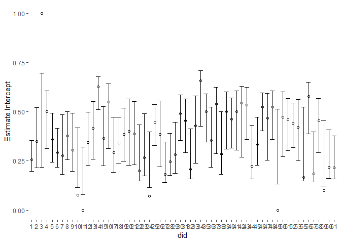
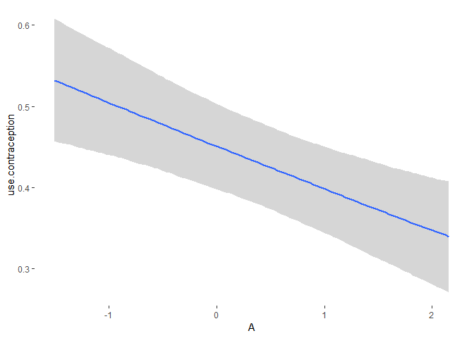

2019HW\_week8\_9\_bangladesh\_brms
================

-   [Model 1: traditional fixed effects model](#model-1-traditional-fixed-effects-model)
-   [Model 2: centered partial pooling model](#model-2-centered-partial-pooling-model)
-   [Model 5 varying slope with covariance](#model-5-varying-slope-with-covariance)
-   [Model 6 using matrix instead of slopes](#model-6-using-matrix-instead-of-slopes)
-   [Model 7 causal inference of age and living children](#model-7-causal-inference-of-age-and-living-children)
-   [Model 9 total influence of age](#model-9-total-influence-of-age)
-   [Model 8: influence of Age with interaction from number of children](#model-8-influence-of-age-with-interaction-from-number-of-children)
-   [Model 10: influence of Age when the number of living children is treated as montonic](#model-10-influence-of-age-when-the-number-of-living-children-is-treated-as-montonic)

``` r
get_prior(data=d, family = binomial,
            use.contraception ~ 0 + factor(did))
```

    ##    prior class        coef group resp dpar nlpar bound
    ## 1            b                                        
    ## 2            b  factordid1                            
    ## 3            b factordid10                            
    ## 4            b factordid11                            
    ## 5            b factordid12                            
    ## 6            b factordid13                            
    ## 7            b factordid14                            
    ## 8            b factordid15                            
    ## 9            b factordid16                            
    ## 10           b factordid17                            
    ## 11           b factordid18                            
    ## 12           b factordid19                            
    ## 13           b  factordid2                            
    ## 14           b factordid20                            
    ## 15           b factordid21                            
    ## 16           b factordid22                            
    ## 17           b factordid23                            
    ## 18           b factordid24                            
    ## 19           b factordid25                            
    ## 20           b factordid26                            
    ## 21           b factordid27                            
    ## 22           b factordid28                            
    ## 23           b factordid29                            
    ## 24           b  factordid3                            
    ## 25           b factordid30                            
    ## 26           b factordid31                            
    ## 27           b factordid32                            
    ## 28           b factordid33                            
    ## 29           b factordid34                            
    ## 30           b factordid35                            
    ## 31           b factordid36                            
    ## 32           b factordid37                            
    ## 33           b factordid38                            
    ## 34           b factordid39                            
    ## 35           b  factordid4                            
    ## 36           b factordid40                            
    ## 37           b factordid41                            
    ## 38           b factordid42                            
    ## 39           b factordid43                            
    ## 40           b factordid44                            
    ## 41           b factordid45                            
    ## 42           b factordid46                            
    ## 43           b factordid47                            
    ## 44           b factordid48                            
    ## 45           b factordid49                            
    ## 46           b  factordid5                            
    ## 47           b factordid50                            
    ## 48           b factordid51                            
    ## 49           b factordid52                            
    ## 50           b factordid53                            
    ## 51           b factordid55                            
    ## 52           b factordid56                            
    ## 53           b factordid57                            
    ## 54           b factordid58                            
    ## 55           b factordid59                            
    ## 56           b  factordid6                            
    ## 57           b factordid60                            
    ## 58           b factordid61                            
    ## 59           b  factordid7                            
    ## 60           b  factordid8                            
    ## 61           b  factordid9

### Model 1: traditional fixed effects model

``` r
b_1 <- brm(data=d, family = binomial,
            use.contraception ~ 0 + factor(did),
            prior = prior(normal(0,1.5), class = b)
            )
```

``` r
fixef(b_1) %>% 
  as.tibble() %>% 
  inv_logit_scaled() %>% 
  bind_cols(d %>% 
    group_by(did) %>% 
    summarise(sample_mean = mean(use.contraception)) 
    ) %>% 
  ggplot(aes(y = Estimate, ymax = `Q97.5`, ymin = `Q2.5`, x = did))+
  geom_errorbar()+
  geom_point(aes(y=sample_mean), shape = 1)
```


### Model 2: centered partial pooling model

``` r
b_2 <- brm(data = d, family = bernoulli,
           use.contraception ~ 1 + (1 | did),
           prior = prior(normal(0,1.5), class  = Intercept) + 
             prior(exponential(1), class = sd)
           )
```

``` r
summary(b_2)
```

    ##  Family: bernoulli 
    ##   Links: mu = logit 
    ## Formula: use.contraception ~ 1 + (1 | did) 
    ##    Data: d (Number of observations: 1934) 
    ## Samples: 4 chains, each with iter = 2000; warmup = 1000; thin = 1;
    ##          total post-warmup samples = 4000
    ## 
    ## Group-Level Effects: 
    ## ~did (Number of levels: 60) 
    ##               Estimate Est.Error l-95% CI u-95% CI Eff.Sample Rhat
    ## sd(Intercept)     0.52      0.08     0.37     0.70       1459 1.00
    ## 
    ## Population-Level Effects: 
    ##           Estimate Est.Error l-95% CI u-95% CI Eff.Sample Rhat
    ## Intercept    -0.54      0.09    -0.72    -0.37       2878 1.00
    ## 
    ## Samples were drawn using sampling(NUTS). For each parameter, Eff.Sample 
    ## is a crude measure of effective sample size, and Rhat is the potential 
    ## scale reduction factor on split chains (at convergence, Rhat = 1).

``` r
b_1 <- add_criterion(b_1, "waic")
b_2 <- add_criterion(b_2, "waic")

w <- loo_compare(b_1, b_2, criterion = "waic")

print(w, simplify = F)
```

    ##     elpd_diff se_diff elpd_waic se_elpd_waic p_waic  se_p_waic waic   
    ## b_2     0.0       0.0 -1257.0      12.5         35.5     0.6    2514.1
    ## b_1    -5.0       3.9 -1262.1      14.5         54.1     1.4    2524.2
    ##     se_waic
    ## b_2    25.0
    ## b_1    28.9

``` r
coef(b_2, robust = T)$did %>% 
  inv_logit_scaled() %>% 
  as_tibble() %>% 
  bind_cols(d %>% 
    group_by(did) %>% 
    summarise(sample_mean = mean(use.contraception)) 
    ) %>%
  ggplot(aes(y = Estimate.Intercept, ymax = `Q97.5.Intercept`, ymin = `Q2.5.Intercept`, x = did))+
  geom_errorbar()+
  geom_point(aes(y=sample_mean), shape = 1)
```



### Model 5 varying slope with covariance

``` r
get_prior(data = d, family = bernoulli,
          use.contraception ~ 1 + urban + (1 + urban | did)
          )
```

    ##                 prior     class      coef group resp dpar nlpar bound
    ## 1                             b                                      
    ## 2                             b     urban                            
    ## 3              lkj(1)       cor                                      
    ## 4                           cor             did                      
    ## 5 student_t(3, 0, 10) Intercept                                      
    ## 6 student_t(3, 0, 10)        sd                                      
    ## 7                            sd             did                      
    ## 8                            sd Intercept   did                      
    ## 9                            sd     urban   did

``` r
b_5 <- brm(data = d, family = bernoulli,
          use.contraception ~ 1 + urban + (1 + urban | did),
          prior = prior(normal(0,1.5), class  = Intercept) + 
                  prior(normal(0, 0.5), class = b) +
                  prior(exponential(1), class = sd) + 
                  prior(lkj(2), class = cor)
          )
```

``` r
summary(b_5)
```

    ##  Family: bernoulli 
    ##   Links: mu = logit 
    ## Formula: use.contraception ~ 1 + urban + (1 + urban | did) 
    ##    Data: d (Number of observations: 1934) 
    ## Samples: 4 chains, each with iter = 2000; warmup = 1000; thin = 1;
    ##          total post-warmup samples = 4000
    ## 
    ## Group-Level Effects: 
    ## ~did (Number of levels: 60) 
    ##                      Estimate Est.Error l-95% CI u-95% CI Eff.Sample Rhat
    ## sd(Intercept)            0.57      0.10     0.39     0.80       1632 1.00
    ## sd(urban)                0.78      0.20     0.40     1.20       1278 1.00
    ## cor(Intercept,urban)    -0.65      0.17    -0.90    -0.24       1726 1.00
    ## 
    ## Population-Level Effects: 
    ##           Estimate Est.Error l-95% CI u-95% CI Eff.Sample Rhat
    ## Intercept    -0.69      0.10    -0.89    -0.49       1894 1.00
    ## urban         0.64      0.16     0.33     0.97       2634 1.00
    ## 
    ## Samples were drawn using sampling(NUTS). For each parameter, Eff.Sample 
    ## is a crude measure of effective sample size, and Rhat is the potential 
    ## scale reduction factor on split chains (at convergence, Rhat = 1).

``` r
coef(b_5, robust = T)$did[,,2]
```

    ##      Estimate Est.Error        Q2.5     Q97.5
    ## 1   1.0613450 0.3864891  0.31015080 1.8250649
    ## 2   0.6185261 0.6372621 -0.76338174 2.0014129
    ## 3   0.8725218 0.7251542 -0.58920018 2.6156876
    ## 4   1.5709711 0.6627801  0.44791670 2.9964205
    ## 5   0.6188746 0.5990989 -0.57687501 1.8182965
    ## 6   1.2632241 0.5540639  0.25925491 2.4224114
    ## 7   0.7724835 0.6516553 -0.65172479 2.2282827
    ## 8   0.8785364 0.5885307 -0.25491720 2.2117125
    ## 9   0.9674888 0.6372938 -0.27102102 2.3305785
    ## 10  1.1739995 0.7329779 -0.28036959 2.8433469
    ## 11  1.5763116 0.8013479  0.10801744 3.3612778
    ## 12  0.4343399 0.5692397 -0.78592023 1.5875522
    ## 13  0.2741187 0.5501781 -0.94016246 1.3688538
    ## 14  1.2318775 0.4369014  0.44148400 2.1254901
    ## 15  0.4359458 0.5744054 -0.74445410 1.5954291
    ## 16  0.5459232 0.5969736 -0.74137733 1.9885483
    ## 17  0.7535421 0.6285658 -0.59949896 2.0815951
    ## 18  0.8529625 0.4835970 -0.11116229 1.8397155
    ## 19  0.9176303 0.5925521 -0.25156991 2.2196966
    ## 20  0.5304012 0.6177935 -0.91658906 1.8840859
    ## 21 -0.2972967 0.6697620 -1.78531187 0.8398060
    ## 22  0.9815271 0.6611313 -0.37801654 2.4697174
    ## 23  0.7892269 0.6592715 -0.58698519 2.2701266
    ## 24  1.2191364 0.7211459 -0.15621541 2.9184399
    ## 25  0.1997119 0.4492059 -0.69829052 1.0611389
    ## 26  0.5646655 0.6620241 -0.87923012 1.9362598
    ## 27  1.1471995 0.5842385  0.03399580 2.3439181
    ## 28  0.7428138 0.5789898 -0.51264199 1.9165375
    ## 29  1.1324444 0.5738069  0.05820883 2.4056819
    ## 30  1.0017643 0.4737070  0.08579025 1.9853849
    ## 31  0.3860337 0.5420753 -0.76111762 1.4625408
    ## 32  0.9724938 0.6826062 -0.35685626 2.5472017
    ## 33  1.1861880 0.6493534 -0.03591463 2.7110932
    ## 34 -0.6840695 0.6314853 -2.00663765 0.4855867
    ## 35  0.4449834 0.4645017 -0.44499045 1.3252143
    ## 36  0.4961221 0.6086252 -0.81737969 1.7587067
    ## 37  0.2751244 0.6913976 -1.24677105 1.6629954
    ## 38  1.2122169 0.6799231 -0.01703848 2.6493579
    ## 39  0.2579789 0.6376914 -1.11831166 1.5504022
    ## 40  0.4798545 0.4858453 -0.51028031 1.4767556
    ## 41 -0.2293545 0.6563858 -1.83146061 0.9205146
    ## 42 -0.2545850 0.7308321 -1.89259331 1.0208873
    ## 43  0.4207228 0.4721122 -0.50787890 1.3774636
    ## 44  0.9457698 0.6303231 -0.34469525 2.4050975
    ## 45  1.1908229 0.5922931  0.13409946 2.5793254
    ## 46  0.4398054 0.4639281 -0.45918994 1.3990435
    ## 47  0.4762408 0.6257423 -0.80346247 1.7964156
    ## 48  0.3853675 0.4878519 -0.63293248 1.3611383
    ## 49  0.9384433 0.7200062 -0.56989202 2.6019415
    ## 50  1.0989825 0.6570087 -0.04372551 2.5913168
    ## 51  0.8244677 0.5145488 -0.13166246 1.8460253
    ## 52 -0.4257848 0.5065664 -1.50389076 0.5344684
    ## 53  0.4965631 0.6375269 -0.85780902 1.8471513
    ## 55  0.2722052 0.7179106 -1.34651968 1.6216712
    ## 56  0.4428331 0.4644548 -0.48849131 1.3852025
    ## 57  0.8557072 0.6206026 -0.35942083 2.1312142
    ## 58 -0.1895673 0.5678362 -1.43242923 0.8726881
    ## 59  1.0270019 0.7207937 -0.31612292 2.6790382
    ## 60  0.7360492 0.5706757 -0.43799996 1.8878024
    ## 61  0.7075696 0.5510629 -0.43644402 1.7621851

``` r
d %>% 
  ggplot(aes(x = as_factor(urban), y = use.contraception))+
  # geom_line()+
  geom_jitter(shape=1, height = 0)+
  facet_wrap(~did, ncol = 10)+
  # theme_fivethirtyeight()+
  theme(panel.grid.major.x = element_blank())
```


``` r
predictions <- d %>% 
  modelr::data_grid(did, urban) %>% 
  tidybayes::add_predicted_draws(b_5) %>%
  # mutate(.prediction = inv_logit_scaled(.prediction)) %>% # do we need this or not?
  group_by(did, urban) %>% 
  summarize(estimate = mean(.prediction))
```

``` r
d %>% 
  ggplot(aes(x = as_factor(urban), y = use.contraception))+
  geom_jitter(shape=1, height = 0)+
  facet_wrap(~did, ncol = 10)+
  geom_line(data = predictions,
            aes(x = as_factor(urban), y = estimate, group = did)
            )+
  theme(panel.grid.major.x = element_blank())
```

 This is the second time I made this chart, and I think the first time I did it wrong by using the inv\_logit to transform what came out of the link function. I think the predicted\_draws and fitted\_draws of brms have already been transformed. same convention for rethinking package.

``` r
pp_check(b_5)
```


``` r
d %>% 
  modelr::data_grid(did, urban) %>% 
  tidybayes::add_predicted_draws(b_5)
```

    ## # A tibble: 480,000 x 7
    ## # Groups:   did, urban, .row [120]
    ##    did   urban  .row .chain .iteration .draw .prediction
    ##    <fct> <int> <int>  <int>      <int> <int>       <int>
    ##  1 1         0     1     NA         NA     1           0
    ##  2 1         0     1     NA         NA     2           0
    ##  3 1         0     1     NA         NA     3           1
    ##  4 1         0     1     NA         NA     4           0
    ##  5 1         0     1     NA         NA     5           0
    ##  6 1         0     1     NA         NA     6           1
    ##  7 1         0     1     NA         NA     7           0
    ##  8 1         0     1     NA         NA     8           0
    ##  9 1         0     1     NA         NA     9           0
    ## 10 1         0     1     NA         NA    10           0
    ## # ... with 479,990 more rows

``` r
d %>% 
  modelr::data_grid(did, urban) %>% 
  posterior_linpred(b_5, newdata = ., summary = F) %>% 
  range()
```

    ## [1] -4.388512  3.287607

fitted(b\_5, transform = logit\_scaled) %&gt;% head

``` r
coefplot(b_5)
```


``` r
tidyfitted(b_5)
```

    ## # A tibble: 104 x 7
    ##    did   urban type  Estimate Est.Error  Q2.5 Q97.5
    ##    <fct> <int> <chr>    <dbl>     <dbl> <dbl> <dbl>
    ##  1 1         1 r        0.385    0.0560 0.279 0.493
    ##  2 1         0 r        0.182    0.0458 0.101 0.277
    ##  3 2         0 r        0.343    0.0769 0.203 0.504
    ##  4 3         1 r        0.559    0.133  0.305 0.825
    ##  5 4         1 r        0.670    0.104  0.465 0.865
    ##  6 4         0 r        0.306    0.0827 0.159 0.480
    ##  7 5         1 r        0.493    0.128  0.247 0.746
    ##  8 5         0 r        0.347    0.0672 0.221 0.485
    ##  9 6         1 r        0.558    0.116  0.338 0.775
    ## 10 6         0 r        0.264    0.0497 0.171 0.366
    ## # ... with 94 more rows

``` r
panels(b_5, xvar = "urban", data = T)
```


``` r
spaghetti(b_5, xvar = "urban")
```


### Model 6 using matrix instead of slopes

``` r
get_prior(data = d, family = bernoulli,
          use.contraception ~ 0 + factor(urban) + (0 + factor(urban) | did)
          )
```

    ##                 prior class         coef group resp dpar nlpar bound
    ## 1                         b                                         
    ## 2                         b factorurban0                            
    ## 3                         b factorurban1                            
    ## 4              lkj(1)   cor                                         
    ## 5                       cor                did                      
    ## 6 student_t(3, 0, 10)    sd                                         
    ## 7                        sd                did                      
    ## 8                        sd factorurban0   did                      
    ## 9                        sd factorurban1   did

``` r
b_6 <- brm(data = d, family = bernoulli,
          use.contraception ~ 0 + factor(urban) + (0 + factor(urban) | did),
          prior = prior(normal(0, 1.5), class = b) +
                  prior(exponential(1), class = sd) + 
                  prior(lkj(2), class = cor)
          )
```

``` r
summary(b_6)
```

    ##  Family: bernoulli 
    ##   Links: mu = logit 
    ## Formula: use.contraception ~ 0 + factor(urban) + (0 + factor(urban) | did) 
    ##    Data: d (Number of observations: 1934) 
    ## Samples: 4 chains, each with iter = 2000; warmup = 1000; thin = 1;
    ##          total post-warmup samples = 4000
    ## 
    ## Group-Level Effects: 
    ## ~did (Number of levels: 60) 
    ##                                Estimate Est.Error l-95% CI u-95% CI
    ## sd(factorurban0)                   0.62      0.10     0.44     0.85
    ## sd(factorurban1)                   0.51      0.16     0.23     0.85
    ## cor(factorurban0,factorurban1)    -0.10      0.28    -0.60     0.47
    ##                                Eff.Sample Rhat
    ## sd(factorurban0)                     1616 1.00
    ## sd(factorurban1)                     1482 1.01
    ## cor(factorurban0,factorurban1)       2263 1.00
    ## 
    ## Population-Level Effects: 
    ##              Estimate Est.Error l-95% CI u-95% CI Eff.Sample Rhat
    ## factorurban0    -0.72      0.11    -0.94    -0.51       2376 1.00
    ## factorurban1     0.02      0.13    -0.24     0.29       3965 1.00
    ## 
    ## Samples were drawn using sampling(NUTS). For each parameter, Eff.Sample 
    ## is a crude measure of effective sample size, and Rhat is the potential 
    ## scale reduction factor on split chains (at convergence, Rhat = 1).

### Model 7 causal inference of age and living children

``` r
d <- d %>% 
  mutate(A = age.centered %>% scale,
         C = living.children %>% scale
         )
b_7 <- brm(data = d, family = bernoulli,
          use.contraception ~ 1 + urban + (1 + urban | did) + A + C,
          prior = prior(normal(0,1.5), class  = Intercept) + 
                  prior(normal(0, 0.5), class = b) +
                  prior(exponential(1), class = sd) + 
                  prior(lkj(2), class = cor)
          )
```

``` r
summary(b_7)
```

    ##  Family: bernoulli 
    ##   Links: mu = logit 
    ## Formula: use.contraception ~ 1 + urban + (1 + urban | did) + A + C 
    ##    Data: d (Number of observations: 1934) 
    ## Samples: 4 chains, each with iter = 2000; warmup = 1000; thin = 1;
    ##          total post-warmup samples = 4000
    ## 
    ## Group-Level Effects: 
    ## ~did (Number of levels: 60) 
    ##                      Estimate Est.Error l-95% CI u-95% CI Eff.Sample Rhat
    ## sd(Intercept)            0.61      0.10     0.43     0.82       1544 1.00
    ## sd(urban)                0.77      0.21     0.38     1.20        826 1.00
    ## cor(Intercept,urban)    -0.63      0.18    -0.87    -0.20       1425 1.00
    ## 
    ## Population-Level Effects: 
    ##           Estimate Est.Error l-95% CI u-95% CI Eff.Sample Rhat
    ## Intercept    -0.72      0.10    -0.93    -0.53       2004 1.00
    ## urban         0.70      0.16     0.38     1.01       2589 1.00
    ## A            -0.26      0.07    -0.40    -0.13       4006 1.00
    ## C             0.51      0.07     0.37     0.66       4076 1.00
    ## 
    ## Samples were drawn using sampling(NUTS). For each parameter, Eff.Sample 
    ## is a crude measure of effective sample size, and Rhat is the potential 
    ## scale reduction factor on split chains (at convergence, Rhat = 1).

### Model 9 total influence of age

``` r
b_9 <- brm(data = d, family = bernoulli,
          use.contraception ~ 1 + urban + (1 + urban | did) + A,
          prior = prior(normal(0,1.5), class  = Intercept) + 
                  prior(normal(0, 0.5), class = b) +
                  prior(exponential(1), class = sd) + 
                  prior(lkj(2), class = cor)
          )
summary(b_9)
```

### Model 8: influence of Age with interaction from number of children

``` r
b_8 <- brm(data = d, family = bernoulli,
          use.contraception ~ 1 + urban + (1 + urban | did) + A + A:C,
          prior = prior(normal(0,1.5), class  = Intercept) + 
                  prior(normal(0, 0.5), class = b) +
                  prior(exponential(1), class = sd) + 
                  prior(lkj(2), class = cor)
          )
summary(b_8)
```

A interaction model cannot block the backdoor!

### Model 10: influence of Age when the number of living children is treated as montonic

``` r
b_10 <- brm(data = d, family = bernoulli,
          use.contraception ~ 1 + urban + (1 + urban | did) + A + mo(living.children),
          prior = prior(normal(0,1.5), class  = Intercept) + 
                  prior(normal(0, 0.5), class = b) +
                  prior(exponential(1), class = sd) + 
                  prior(lkj(2), class = cor)
          )
summary(b_10)
```

``` r
marginal_effects(b_10)
```


