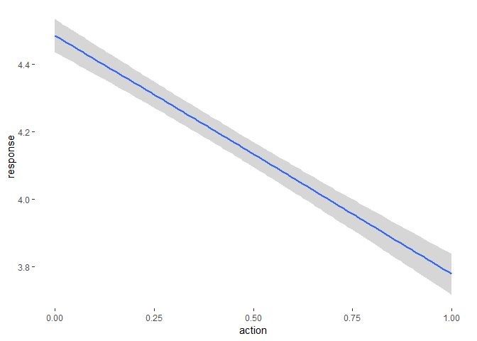
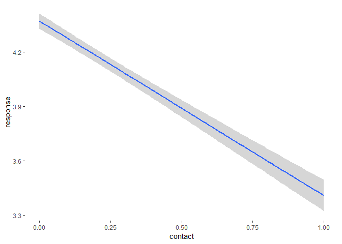
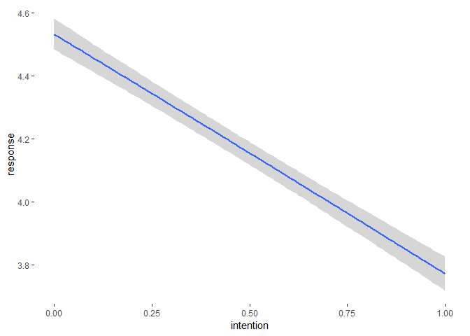
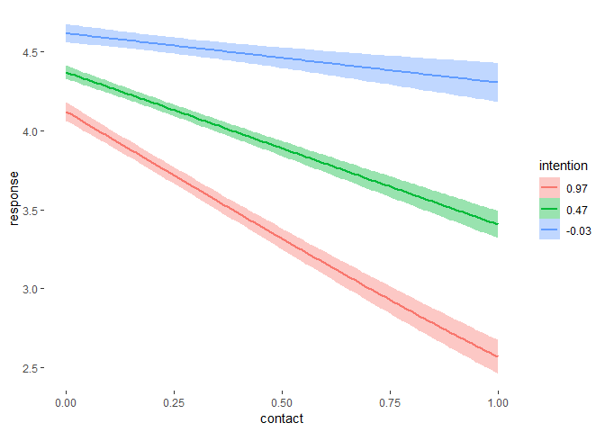

2019HW\_week8\_Trolley\_brms
================

-   [Trace the model developed in the book](#trace-the-model-developed-in-the-book)

### Trace the model developed in the book

``` r
m_1 <- brm(data = Trolley, family = cumulative,
           response ~ action + contact + intention + intention:action + intention:contact,
          prior = prior(normal(0, 0.5), class = b) + 
                  prior(normal(0,1.5), class = Intercept)
          )
summary(m_1)
```

``` r
marginal_effects(m_1)
```


