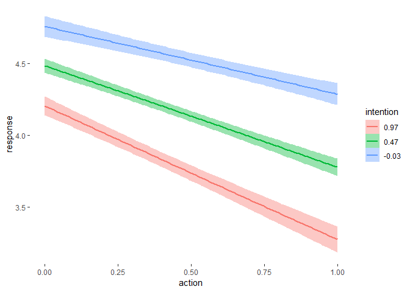

2019HW\_week8\_Trolley\_brms
================

-   [Trace the model developed in the book](#trace-the-model-developed-in-the-book)
-   [Model 1: varying intercepts](#model-1-varying-intercepts)
-   [Model 2: Impact of education](#model-2-impact-of-education)
-   [Model 3: Gender as another comfounder for Resp ~ Education](#model-3-gender-as-another-comfounder-for-resp-education)

### Trace the model developed in the book

``` r
m_1 <- brm(data = Trolley, family = cumulative,
           response ~ action + contact + intention + intention:action + intention:contact,
          prior = prior(normal(0, 0.5), class = b) + 
                  prior(normal(0,1.5), class = Intercept)
          )
summary(m_1)
```

``` r
marginal_effects(m_1)
```



### Model 1: varying intercepts

``` r
m_2 <- brm(data = Trolley, family = cumulative,
           response ~ 1 + action + contact + intention + intention:action + intention:contact + (1|id),
           prior = prior(normal(0,0.5), class = b) +
                   prior(normal(0, 1.5), class = Intercept)+
                   prior(exponential(1), class = sd)
           )
summary(m_2)
```

#### WAIC comparison

``` r
m_1 <- add_waic(m_1)
m_2 <- add_waic(m_2)

w <- loo_compare(m_1, m_2, criterion = "waic")

print(w, simplify = F)
```

model with varying effects is preferred, but it also introduces more parameters

#### LOO comparison

``` r
m_1 <- add_loo(m_1)
m_2 <- add_loo(m_2)

w <- loo_compare(m_1, m_2, criterion = "loo")

print(w, simplify = F)
```

Similiar result from WAIC comparison

### Model 2: Impact of education

``` r
Trolley$age.scaled <- Trolley$age %>% scale
Trolley <- Trolley %>% 
  mutate(edu.ordered = factor(edu, ordered = TRUE, levels = c("Elementary School","Middle School", "Some High School", "High School Graduate", "Some College", "Bachelor's Degree", "Graduate Degree","Master's Degree")))

get_prior(data = Trolley, family = cumulative,
          response ~ action + intention + contact + intention:action + intention:contact + mo(edu.ordered) + age.scaled
          )
```

    ##                  prior     class              coef group resp dpar nlpar
    ## 1                              b                                        
    ## 2                              b            action                      
    ## 3                              b  action:intention                      
    ## 4                              b        age.scaled                      
    ## 5                              b           contact                      
    ## 6                              b         intention                      
    ## 7                              b intention:contact                      
    ## 8                              b     moedu.ordered                      
    ## 9  student_t(3, 0, 10) Intercept                                        
    ## 10                     Intercept                 1                      
    ## 11                     Intercept                 2                      
    ## 12                     Intercept                 3                      
    ## 13                     Intercept                 4                      
    ## 14                     Intercept                 5                      
    ## 15                     Intercept                 6                      
    ## 16                          simo    moedu.ordered1                      
    ##    bound
    ## 1       
    ## 2       
    ## 3       
    ## 4       
    ## 5       
    ## 6       
    ## 7       
    ## 8       
    ## 9       
    ## 10      
    ## 11      
    ## 12      
    ## 13      
    ## 14      
    ## 15      
    ## 16

``` r
m_3 <- brm(data = Trolley, family = cumulative,
          response ~ action + intention + contact + intention:action + intention:contact + mo(edu.ordered) + age.scaled,
          prior = prior(normal(0,0.5), class = b)+
                  prior(normal(0, 1.5), class = Intercept)+
                  prior(dirichlet(rep(2, 7)), class = simo, coef = "moedu.ordered1")
          )
```

``` r
summary(m_3)
```

    ##  Family: cumulative 
    ##   Links: mu = logit; disc = identity 
    ## Formula: response ~ action + intention + contact + intention:action + intention:contact + mo(edu.ordered) + age.scaled 
    ##    Data: Trolley (Number of observations: 9930) 
    ## Samples: 4 chains, each with iter = 2000; warmup = 1000; thin = 1;
    ##          total post-warmup samples = 4000
    ## 
    ## Population-Level Effects: 
    ##                   Estimate Est.Error l-95% CI u-95% CI Eff.Sample Rhat
    ## Intercept[1]         -2.49      0.09    -2.68    -2.33       1190 1.00
    ## Intercept[2]         -1.79      0.08    -1.98    -1.64       1174 1.00
    ## Intercept[3]         -1.20      0.08    -1.38    -1.05       1123 1.01
    ## Intercept[4]         -0.16      0.08    -0.34    -0.01       1043 1.01
    ## Intercept[5]          0.51      0.08     0.33     0.67       1049 1.01
    ## Intercept[6]          1.42      0.09     1.24     1.58       1075 1.01
    ## action               -0.48      0.05    -0.58    -0.37       2569 1.00
    ## intention            -0.30      0.06    -0.41    -0.18       2334 1.00
    ## contact              -0.35      0.07    -0.48    -0.21       2778 1.00
    ## age.scaled           -0.10      0.02    -0.14    -0.06       2428 1.00
    ## action:intention     -0.43      0.08    -0.59    -0.28       2429 1.00
    ## intention:contact    -1.24      0.10    -1.42    -1.05       2537 1.00
    ## moedu.ordered         0.23      0.10    -0.03     0.38        850 1.00
    ## 
    ## Simplex Parameters: 
    ##                   Estimate Est.Error l-95% CI u-95% CI Eff.Sample Rhat
    ## moedu.ordered1[1]     0.11      0.07     0.01     0.28       3844 1.00
    ## moedu.ordered1[2]     0.12      0.08     0.02     0.31       3776 1.00
    ## moedu.ordered1[3]     0.09      0.06     0.01     0.24       2982 1.00
    ## moedu.ordered1[4]     0.07      0.05     0.01     0.20       1825 1.00
    ## moedu.ordered1[5]     0.43      0.14     0.08     0.67       1243 1.00
    ## moedu.ordered1[6]     0.08      0.06     0.01     0.23       3457 1.00
    ## moedu.ordered1[7]     0.10      0.07     0.01     0.26       4590 1.00
    ## 
    ## Samples were drawn using sampling(NUTS). For each parameter, Eff.Sample 
    ## is a crude measure of effective sample size, and Rhat is the potential 
    ## scale reduction factor on split chains (at convergence, Rhat = 1).

### Model 3: Gender as another comfounder for Resp ~ Education

``` r
m_4 <- brm(data = Trolley, family = cumulative,
          response ~ action + intention + contact + intention:action + intention:contact + mo(edu.ordered) + age.scaled + male,
          prior = prior(normal(0,0.5), class = b)+
                  prior(normal(0, 1.5), class = Intercept)+
                  prior(dirichlet(rep(2, 7)), class = simo, coef = "moedu.ordered1")
          )
```

``` r
summary(m_4)
```

    ##  Family: cumulative 
    ##   Links: mu = logit; disc = identity 
    ## Formula: response ~ action + intention + contact + intention:action + intention:contact + mo(edu.ordered) + age.scaled + male 
    ##    Data: Trolley (Number of observations: 9930) 
    ## Samples: 4 chains, each with iter = 2000; warmup = 1000; thin = 1;
    ##          total post-warmup samples = 4000
    ## 
    ## Population-Level Effects: 
    ##                   Estimate Est.Error l-95% CI u-95% CI Eff.Sample Rhat
    ## Intercept[1]         -2.40      0.13    -2.67    -2.16        960 1.01
    ## Intercept[2]         -1.71      0.13    -1.97    -1.47        963 1.01
    ## Intercept[3]         -1.10      0.13    -1.36    -0.87        964 1.01
    ## Intercept[4]         -0.05      0.13    -0.30     0.19        961 1.01
    ## Intercept[5]          0.64      0.13     0.39     0.88        970 1.01
    ## Intercept[6]          1.57      0.13     1.31     1.81        993 1.01
    ## action               -0.48      0.05    -0.59    -0.38       1893 1.00
    ## intention            -0.30      0.06    -0.41    -0.19       1695 1.00
    ## contact              -0.35      0.07    -0.48    -0.22       2126 1.00
    ## age.scaled           -0.07      0.02    -0.11    -0.02       1629 1.00
    ## male                  0.57      0.04     0.49     0.63       4010 1.00
    ## action:intention     -0.44      0.08    -0.59    -0.28       1861 1.00
    ## intention:contact    -1.26      0.09    -1.45    -1.08       2072 1.00
    ## moedu.ordered        -0.05      0.17    -0.36     0.24        815 1.01
    ## 
    ## Simplex Parameters: 
    ##                   Estimate Est.Error l-95% CI u-95% CI Eff.Sample Rhat
    ## moedu.ordered1[1]     0.16      0.10     0.02     0.42       3268 1.00
    ## moedu.ordered1[2]     0.14      0.09     0.02     0.35       4051 1.00
    ## moedu.ordered1[3]     0.14      0.09     0.02     0.37       3459 1.00
    ## moedu.ordered1[4]     0.15      0.10     0.02     0.40       1926 1.00
    ## moedu.ordered1[5]     0.15      0.14     0.01     0.51        909 1.01
    ## moedu.ordered1[6]     0.12      0.08     0.02     0.32       4462 1.00
    ## moedu.ordered1[7]     0.13      0.08     0.02     0.33       4540 1.00
    ## 
    ## Samples were drawn using sampling(NUTS). For each parameter, Eff.Sample 
    ## is a crude measure of effective sample size, and Rhat is the potential 
    ## scale reduction factor on split chains (at convergence, Rhat = 1).
