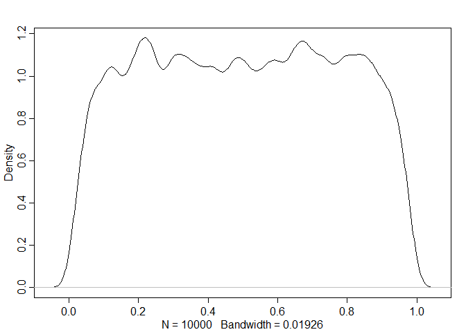
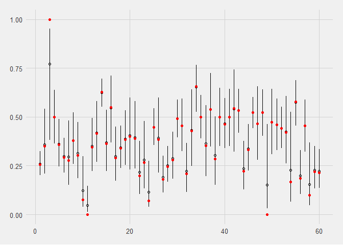
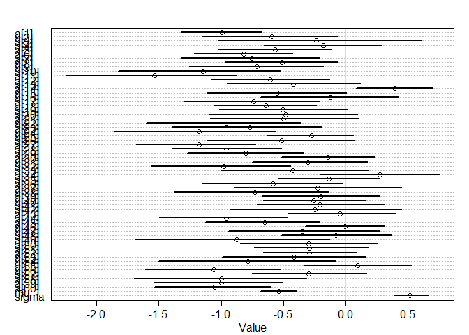
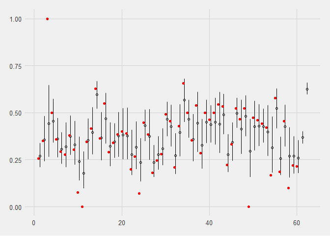
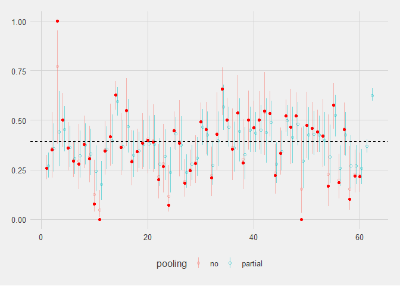

2019HW\_week9&10\_bangladesh
================

-   [bangladeshy birth rates](#bangladeshy-birth-rates)
    -   [Would prefer to tackle the series of questions on bangladeshy birth rates questions first](#would-prefer-to-tackle-the-series-of-questions-on-bangladeshy-birth-rates-questions-first)
    -   [Model 1: traditional fixed effects model](#model-1-traditional-fixed-effects-model)
    -   [Model 2 Centered partial pooling version](#model-2-centered-partial-pooling-version)

bangladeshy birth rates
-----------------------

### Would prefer to tackle the series of questions on bangladeshy birth rates questions first

Load data

``` r
data("bangladesh")
d <- bangladesh
d %>% glimpse
```

    ## Observations: 1,934
    ## Variables: 6
    ## $ woman             <int> 1, 2, 3, 4, 5, 6, 7, 8, 9, 10, 11, 12, 13, 1...
    ## $ district          <int> 1, 1, 1, 1, 1, 1, 1, 1, 1, 1, 1, 1, 1, 1, 1,...
    ## $ use.contraception <int> 0, 0, 0, 0, 0, 0, 0, 0, 0, 0, 1, 0, 0, 0, 0,...
    ## $ living.children   <int> 4, 1, 3, 4, 1, 1, 4, 4, 2, 4, 1, 1, 2, 4, 4,...
    ## $ age.centered      <dbl> 18.4400, -5.5599, 1.4400, 8.4400, -13.5590, ...
    ## $ urban             <int> 1, 1, 1, 1, 1, 1, 1, 1, 1, 1, 1, 1, 1, 1, 1,...

The professor is super kind to alert us the district is not a factor and actually contains one missing district: 54

I shall try to find it out

``` r
rng <- range(d$district)
which(!(rng[1]:rng[2] %in% d$district))
```

    ## [1] 54

``` r
d <- d %>% 
  mutate(district_id = district %>% as.factor %>% as.integer)
```

and it worked!

``` r
rng <- range(d$district_id)
which(!(rng[1]:rng[2] %in% d$district_id))
```

    ## integer(0)

``` r
dat <- with(d,
            list(dist_id = district_id,
                 contraception = use.contraception %>% as.integer()
                   )
            )
```

### Model 1: traditional fixed effects model

should use better priors than norm(0,1)

``` r
a <- rnorm(1e4,0,1.5)
p <- inv_logit(a)
dens(p)
```



``` r
m_contra_1 <- ulam(
  alist(
    contraception ~ dbinom(1, p),
    logit(p) <- a[dist_id],
    a[dist_id] ~ dnorm(0,1.5)
  ), data = dat, cores = 4, chains = 4, log_lik = 4 
)
```

just a quick look at the posterier samples

``` r
precis(m_contra_1, depth = 2) %>% data.frame -> post_summary
post_summary <- post_summary %>% 
  mutate(dist_id = 1:n(),
         ymin = X5.5. %>% inv_logit(),
         ymax = X94.5.%>% inv_logit(),
         y = mean %>% inv_logit(),
         pooling = "no"
         )
data_proportion <- d %>% group_by(district_id) %>% summarise(proportion = mean(use.contraception))
```

``` r
post_summary %>%
  ggplot(aes(x = dist_id, y = y, ymax = ymax, ymin = ymin))+
  geom_point(shape = 1)+
  geom_linerange()+
  geom_point(data = data_proportion, aes(x = district_id, y = proportion), color = "red", inherit.aes = F)+
  labs(x = "district ID", y = "probability of using contraception")+
  theme_fivethirtyeight()
```



### Model 2 Centered partial pooling version

Centered version first and see how it goes

``` r
m_contra_2 <- ulam(
  alist(
    contraception ~ dbinom(1, p),
    logit(p) <- a[dist_id],
    a[dist_id] ~ dnorm(mu, sigma),
    mu ~ dnorm(0, 1.5),
    sigma ~ dexp(1)
  ), data = dat, cores = 4, chains = 4, log_lik = 4 
)
```

``` r
precis(m_contra_2, depth = 2) %>% plot
```



``` r
precis(m_contra_2, depth = 2) %>% data.frame -> post_summary2
post_summary2 <- post_summary2 %>% 
  mutate(dist_id = 1:n()+0.3,
         ymin = X5.5. %>% inv_logit(),
         ymax = X94.5.%>% inv_logit(),
         y = mean %>% inv_logit(),
         pooling = "partial"
         )
data_proportion <- d %>% group_by(district_id) %>% summarise(proportion = mean(use.contraception))
```

``` r
post_summary2 %>%
  ggplot(aes(x = dist_id, y = y, ymax = ymax, ymin = ymin))+
  geom_point(shape = 1)+
  geom_linerange()+
  geom_point(data = data_proportion, aes(x = district_id, y = proportion), color = "red", inherit.aes = F)+
  labs(x = "district ID", y = "probability of using contraception")+
  theme_fivethirtyeight()
```

 Time to contrast the models

``` r
post_summary <- post_summary %>% 
  bind_rows(post_summary2)
```

``` r
post_summary %>%
  ggplot(aes(x = dist_id, y = y, ymax = ymax, ymin = ymin, color = pooling))+
  geom_point(shape = 1, alpha=0.5)+
  geom_linerange(alpha=0.5)+
  geom_point(data = data_proportion, aes(x = district_id, y = proportion), color = "red", inherit.aes = F)+
  geom_hline(yintercept = mean(d$use.contraception), linetype = "dashed")+
  labs(x = "district ID", y = "probability of using contraception")+
  theme_fivethirtyeight()
```



This is problemmatic - if we look at district 3, the partial pooling results seems to gravitate towards below 0.5, where data is clearly 1. checked the solutions and yes indeed it should shrink to the global mean!

``` r
d %>% 
  count(district) %>% 
  filter(n<10)
```

    ## # A tibble: 3 x 2
    ##   district     n
    ##      <int> <int>
    ## 1        3     2
    ## 2       49     4
    ## 3       55     6
